## 打开IntelliJ IDEA

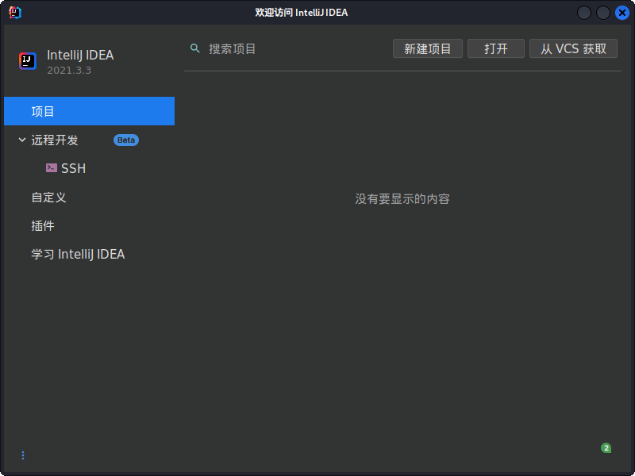

## 创建一个新项目

+ 点击下一步。

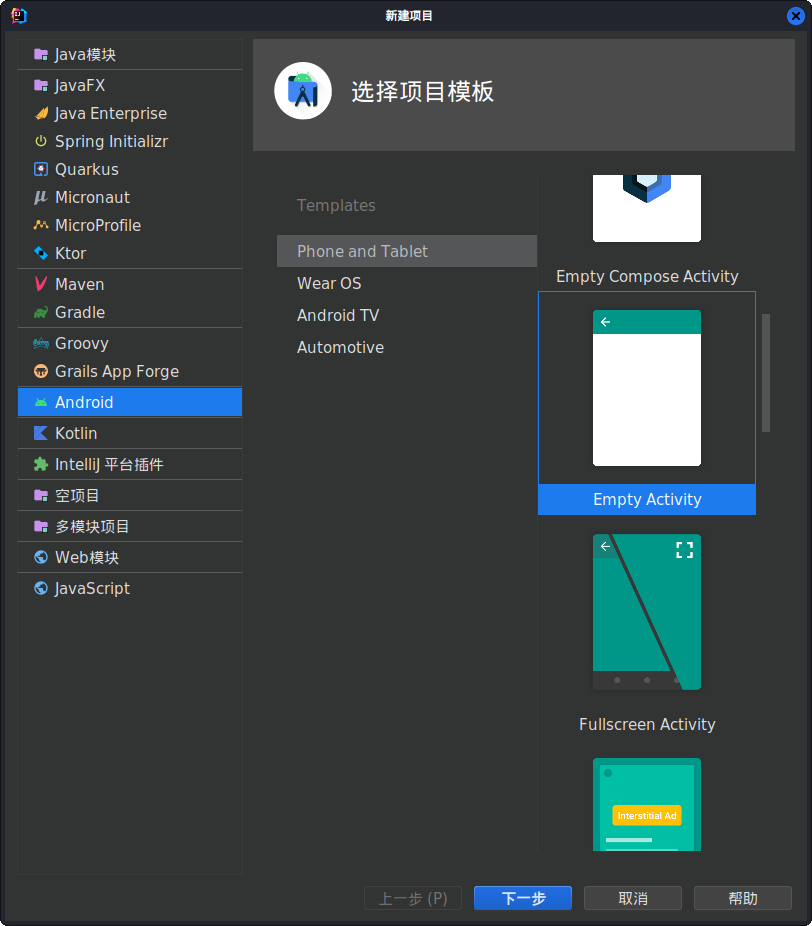

+ 点击完成。

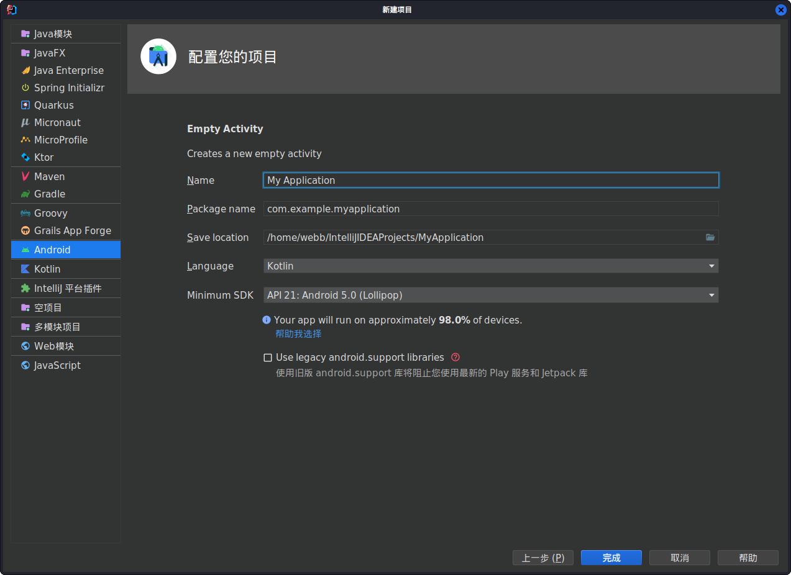

## 等待项目创建完成

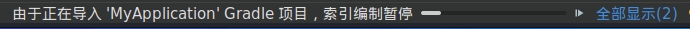

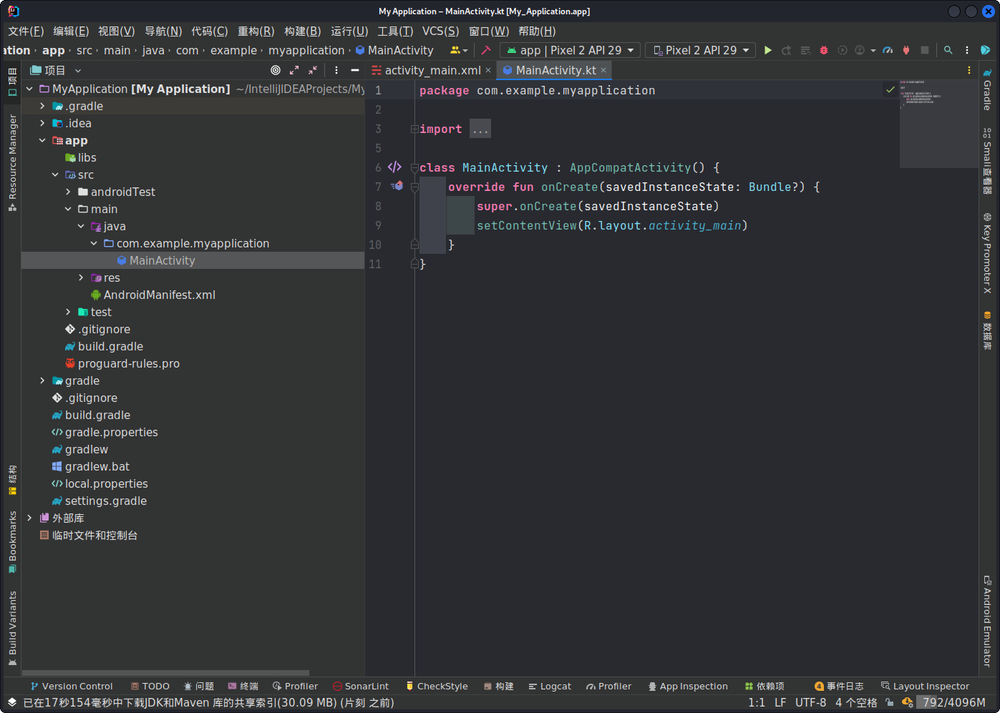

## 写入一个简单的提示功能

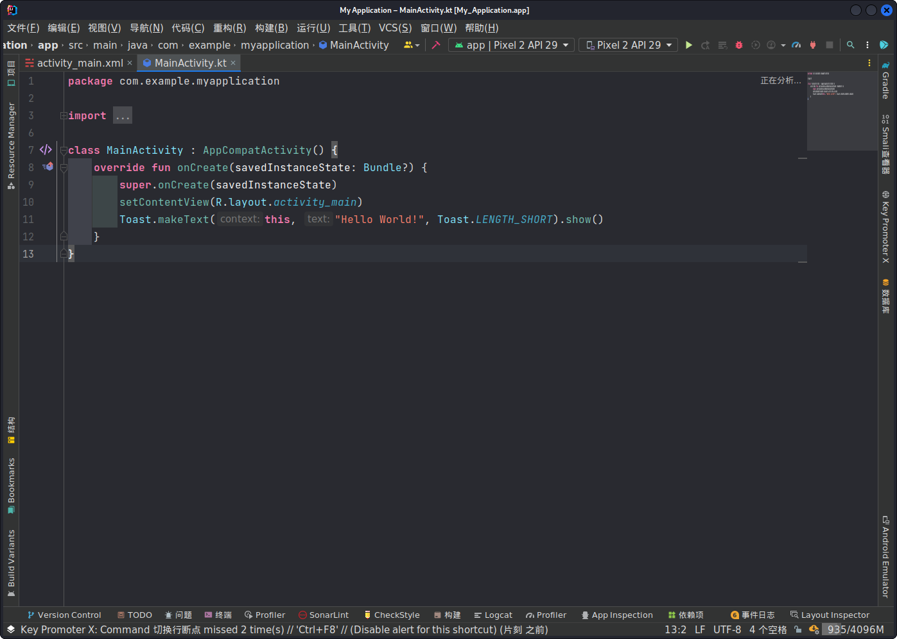

```kotlin
package com.example.myapplication

import androidx.appcompat.app.AppCompatActivity
import android.os.Bundle
import android.view.View
import android.widget.Toast

class MainActivity : AppCompatActivity() {
    override fun onCreate(savedInstanceState: Bundle?) {
        super.onCreate(savedInstanceState)
        setContentView(R.layout.activity_main)

        /**
         * 根据id找到应用的应用栏并设置点击事件，点击后显示Hello World!的提示。
         */
        findViewById<View>(R.id.action_bar).setOnClickListener {
            Toast.makeText(this, "Hello World!", Toast.LENGTH_SHORT).show()
        }
    }
}
```

## 构建项目

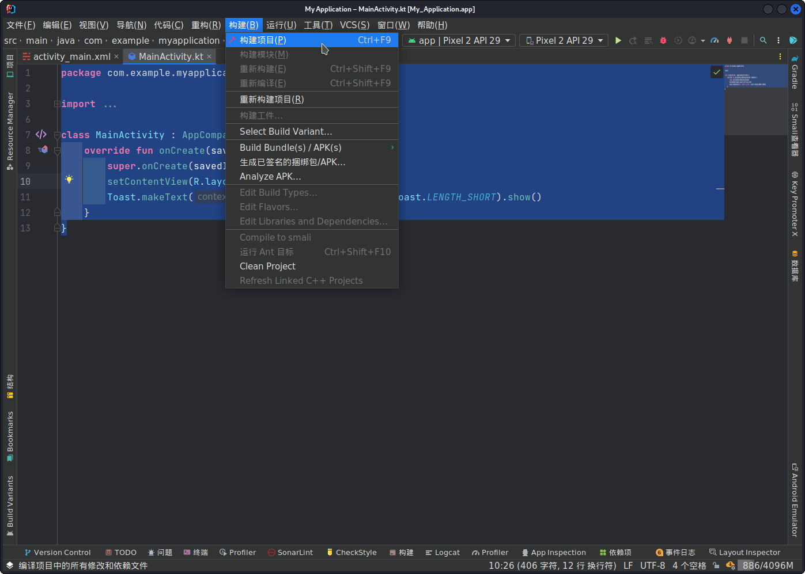

+ 构建完成。

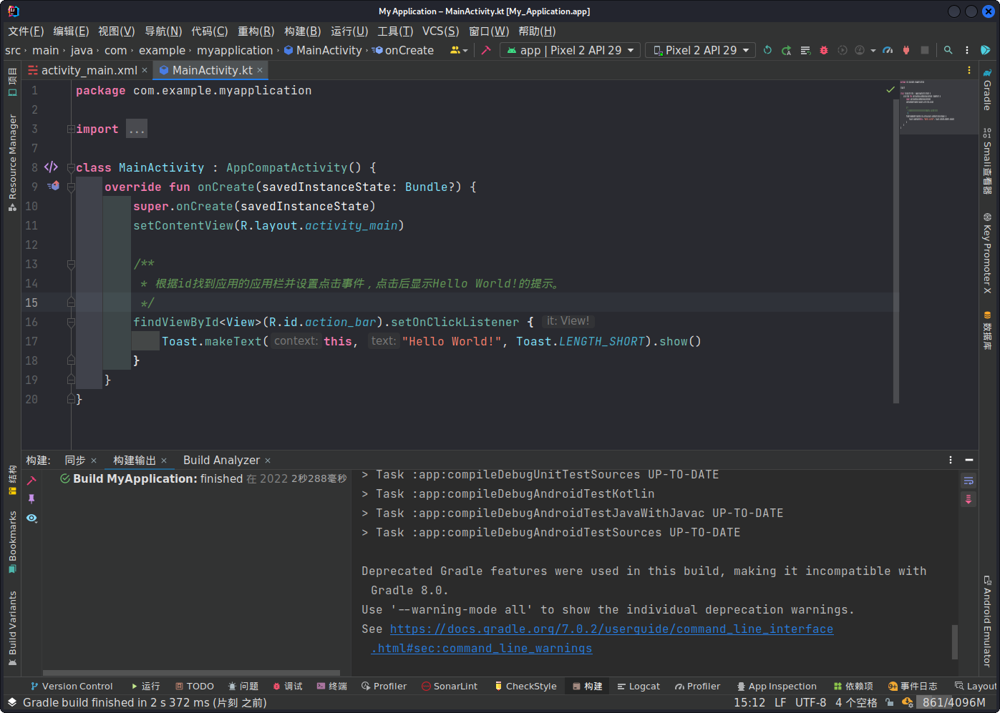

## 反编译应用

+ 在终端打开。

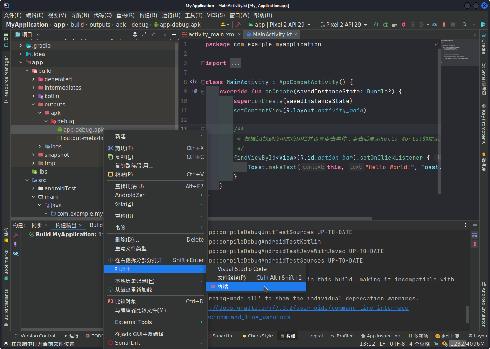

+ 使用`apktool`。

```bash
┌──(webb㉿kali)-[~/…/build/outputs/apk/debug]
└─$ apktool d app-debug.apk       
Picked up _JAVA_OPTIONS: -Dawt.useSystemAAFontSettings=on -Dswing.aatext=true
I: Using Apktool 2.5.0-dirty on app-debug.apk
I: Loading resource table...
I: Decoding AndroidManifest.xml with resources...
I: Loading resource table from file: /home/webb/.local/share/apktool/framework/1.apk
I: Regular manifest package...
I: Decoding file-resources...
I: Decoding values */* XMLs...
I: Baksmaling classes.dex...
I: Baksmaling classes3.dex...
I: Baksmaling classes2.dex...
I: Copying assets and libs...
I: Copying unknown files...
I: Copying original files...
```

+ 如果没有`apktool`就使用`sudo apt-get install apktool -y`。

## 打开反编译完成的项目

+ 打开项目。

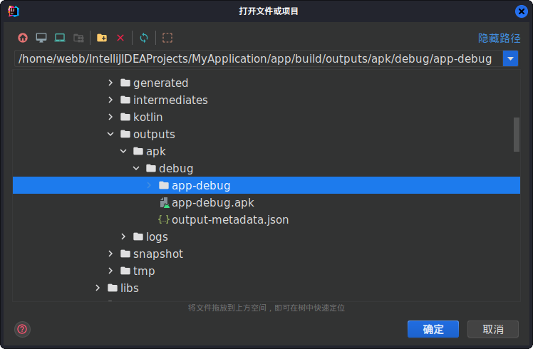

+ 配置Android框架。

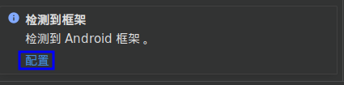

## 配置调试功能

+ 找到需要调试的文件。

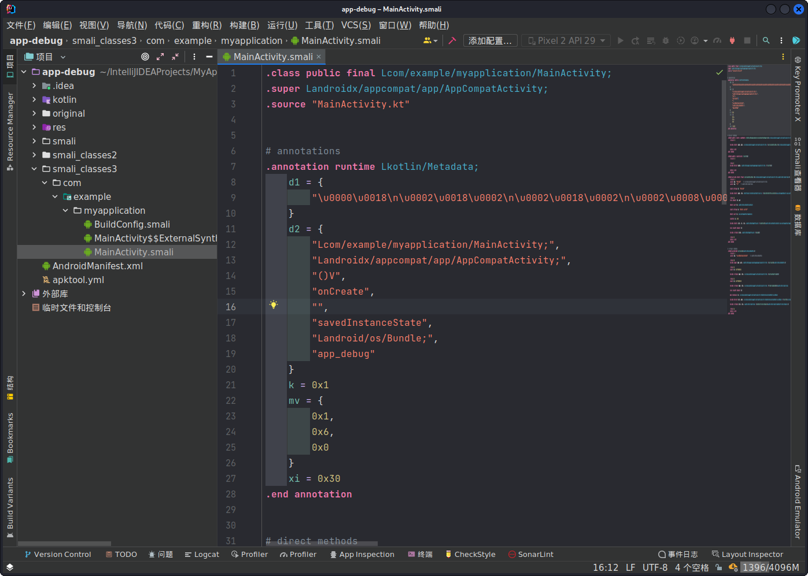

+ 找到需要调试的代码。

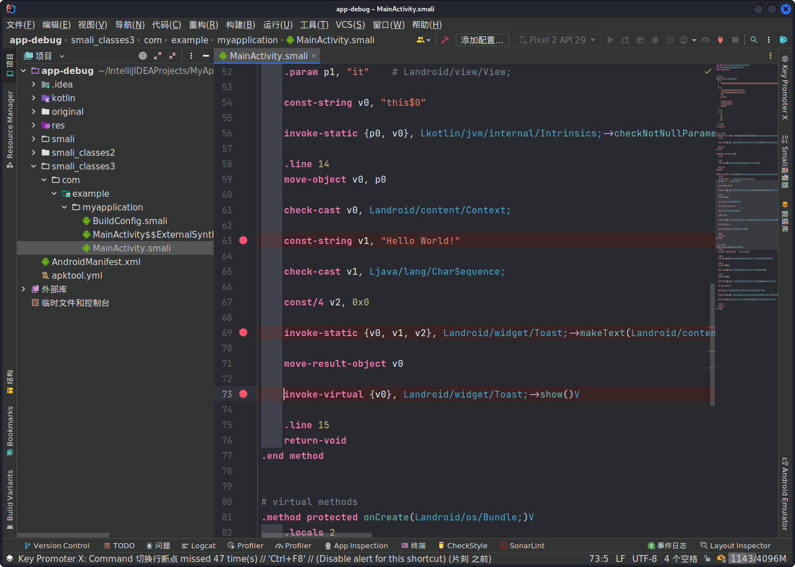

+ 使用IntelliJ IDEA的调试功能。

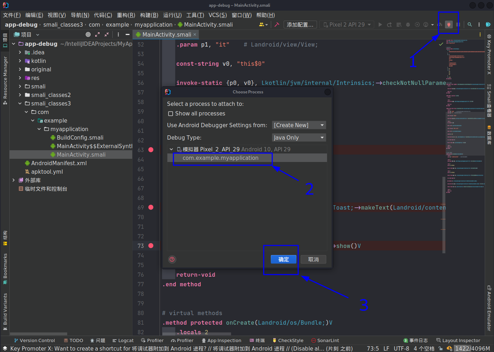

+ 调试功能开启完成。

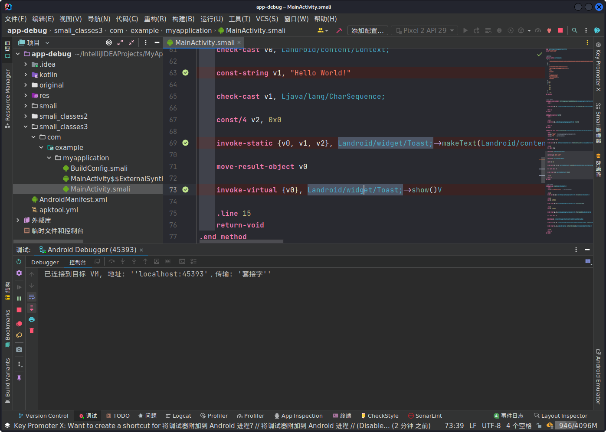

## 开始调试

+ 启动软件。

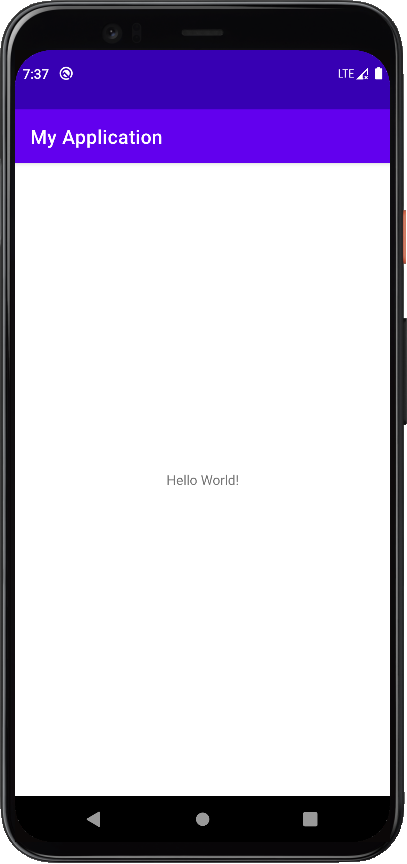

+ 点击应用栏触发代码和触发调试功能。

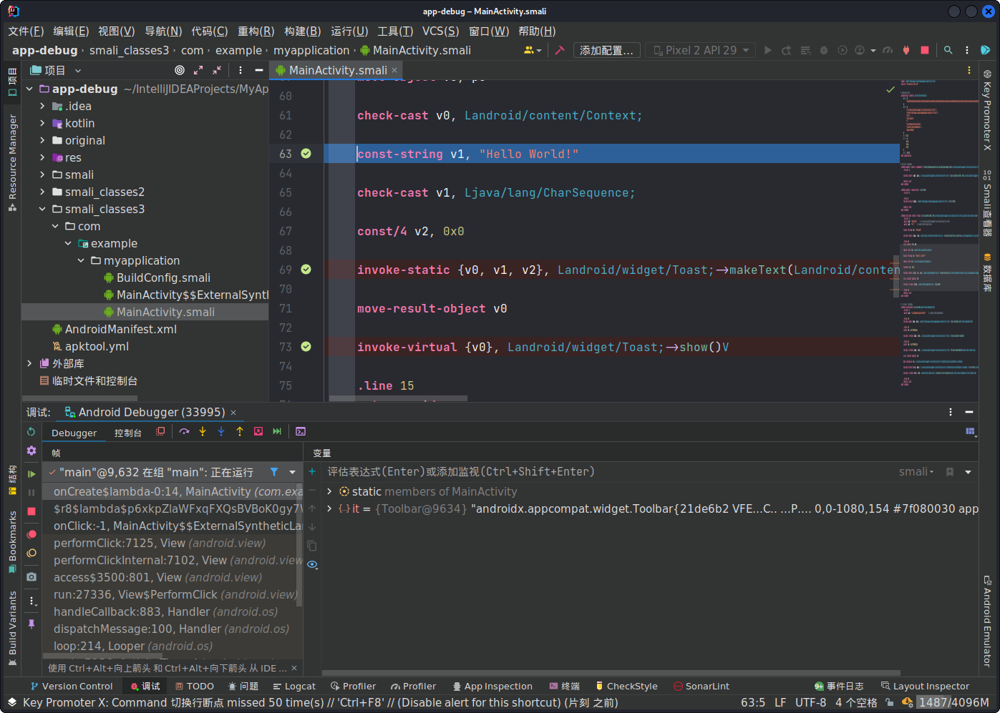
