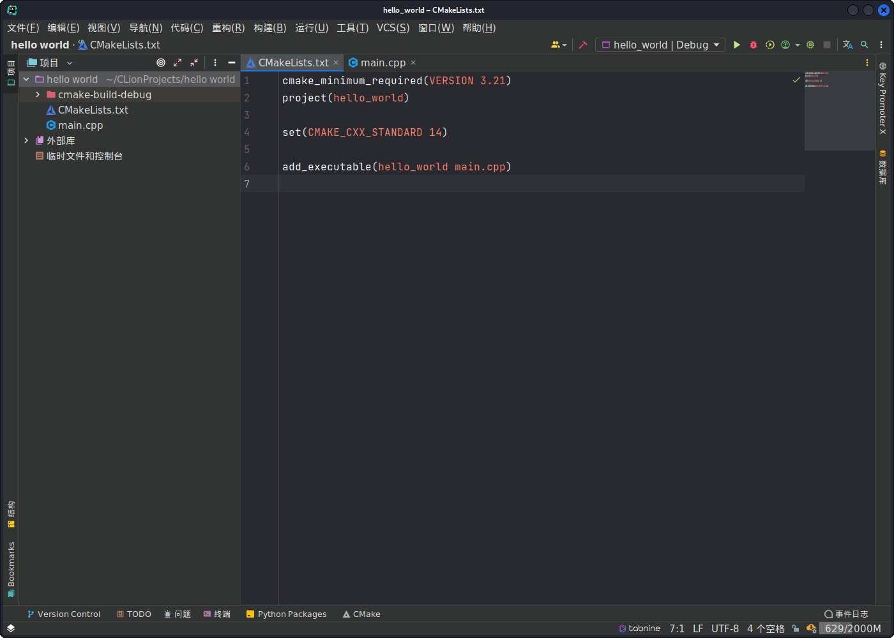
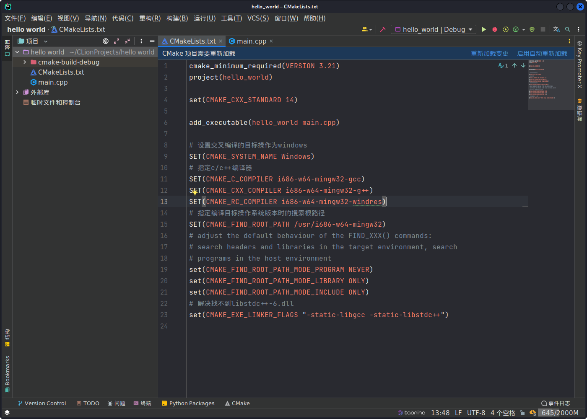
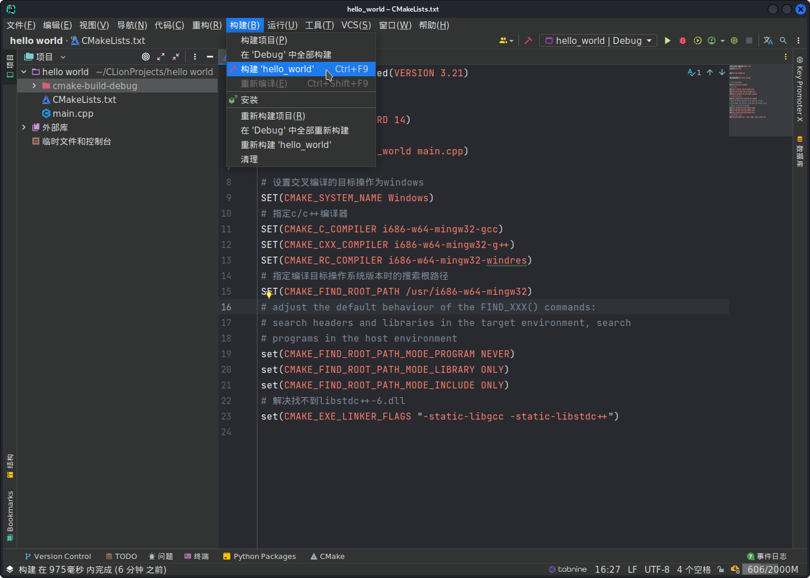
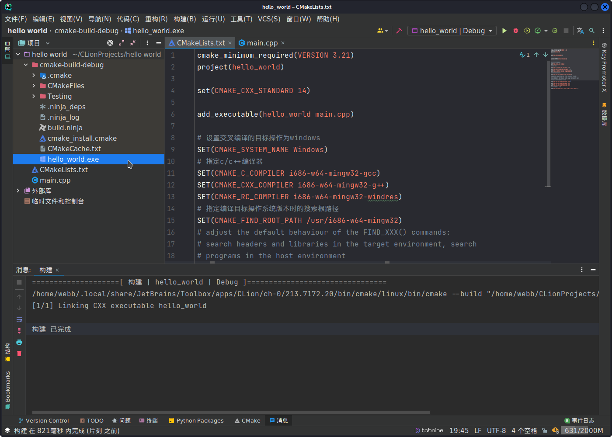

### 配置环境

+ 安装MinGW-w64

```bash
sudo apt-get install gcc-mingw-w64
```

+ MinGW-w64使用。

```bash
# C
i686-w64-mingw32-gcc-win32 main.c -o main.exe

# C++
i686-w64-mingw32-c++-win32 main.cpp -o main.exe
```


### 创建项目

+ 这里我利用Clion创建一个C++的项目。



+ 修改`CMakeLists.txt`文件的内容。

```text
cmake_minimum_required(VERSION 3.21)
project(hello_world)

set(CMAKE_CXX_STANDARD 14)

add_executable(hello_world main.cpp)

# 设置交叉编译的目标操作为windows
SET(CMAKE_SYSTEM_NAME Windows)
# 指定c/c++编译器
SET(CMAKE_C_COMPILER i686-w64-mingw32-gcc)
SET(CMAKE_CXX_COMPILER i686-w64-mingw32-g++)
SET(CMAKE_RC_COMPILER i686-w64-mingw32-windres)
# 指定编译目标操作系统版本时的搜索根路径
SET(CMAKE_FIND_ROOT_PATH /usr/i686-w64-mingw32)

# adjust the default behaviour of the FIND_XXX() commands:
# search headers and libraries in the target environment, search
# programs in the host environment
set(CMAKE_FIND_ROOT_PATH_MODE_PROGRAM NEVER)
set(CMAKE_FIND_ROOT_PATH_MODE_LIBRARY ONLY)
set(CMAKE_FIND_ROOT_PATH_MODE_INCLUDE ONLY)
# 解决找不到libstdc++-6.dll
set(CMAKE_EXE_LINKER_FLAGS "-static-libgcc -static-libstdc++")
```

+ 点击`重新加载变更`或者`启用自动重新加载`。



+ 点击**构建**然后选择**构建‘项目名称’**



+ 构建完成之后打开**cmake-build-debug**文件夹下面会生成exe文件。

