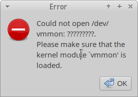
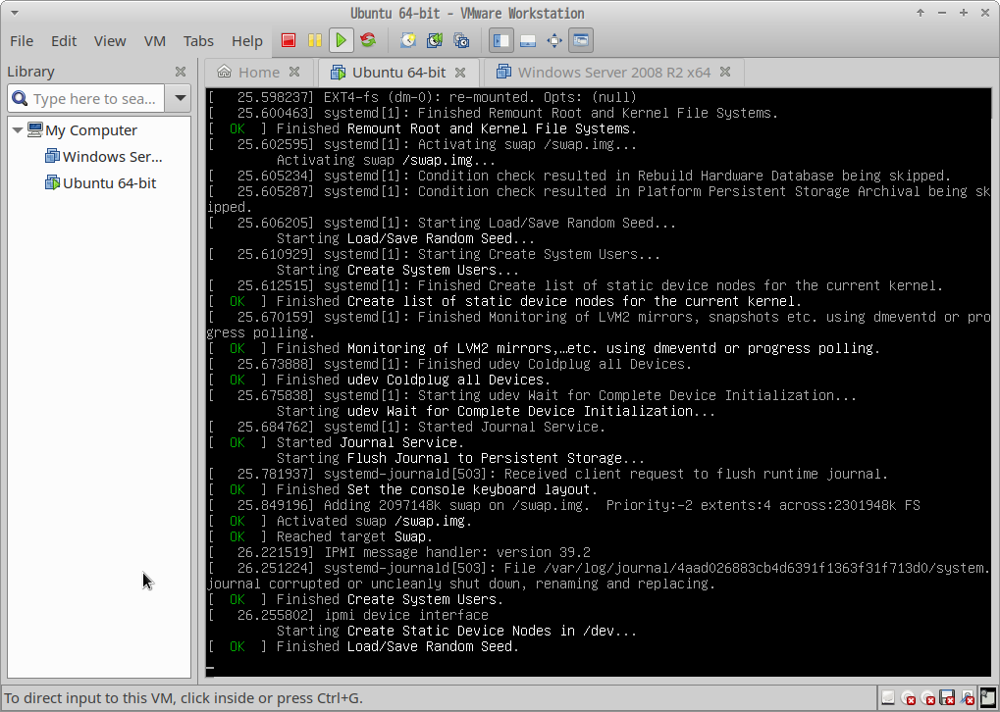

## 错误信息 

**Could not open /dev/vmmon: ?????????.
Please make sure that the kernel module `vmmon' is loaded.**



## 问题描述

+ 安装完成VMware Workstation是可以正常使用，重启VMware Workstation就出现该问题。

+ 这是因为没有启动vmware的服务。

## 解决问题

```bash
webb@localhost:~> sudo /etc/init.d/vmware start 
[sudo] root 的密码：
Starting VMware services:
   Virtual machine monitor                                             done
   Virtual machine communication interface                             done
   VM communication interface socket family                            done
   Virtual ethernet                                                    done
   VMware Authentication Daemon                                        done
   Shared Memory Available    
```

+ 问题解决

